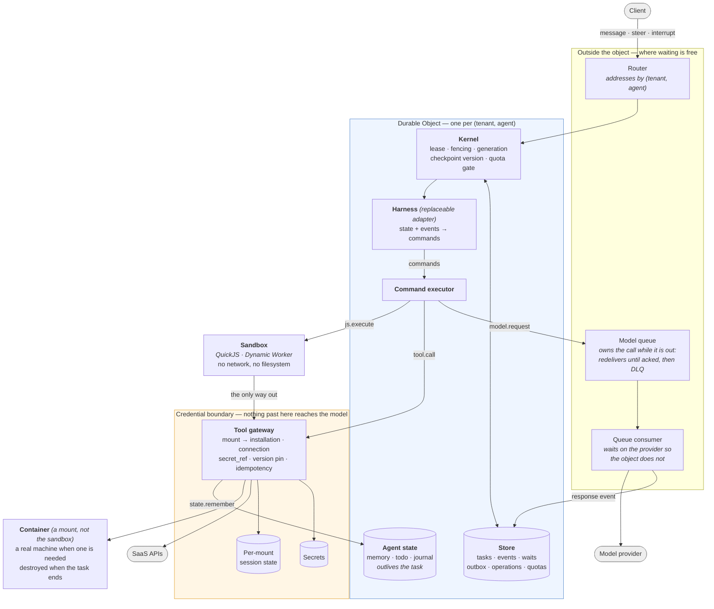

# antiproton

A durable, multi-tenant runtime for agents that act on real systems, on
infrastructure that costs nothing while nobody is asking it anything.

The agent loop itself is commodity — bring your own, or use the reference one.
What this provides is everything underneath it, and it is built for four things
at once:

- **Multi-tenant, structurally.** Two tenants are two Durable Objects with two
  SQLite databases. Cross-tenant data is not in the database being queried, so
  isolation does not depend on remembering a `WHERE` clause.
- **Server-side.** No laptop, no `.agent` directory, no process to keep alive.
  An agent survives a crash, an eviction and a deploy, and resumes.
- **Scale to zero, pay as you go.** An idle agent runs nothing: no process, no
  poller, no armed timer, no container. It costs storage and nothing else, and
  the next message rebuilds it from its log.
- **The agent never holds a credential.** It acts on your systems, and its
  context never contains your keys.

## Costing nothing while idle

Scale-to-zero is easy to claim and easy to lose one careless `await` at a time,
so the numbers below are measured on the deployment rather than reasoned about.

Durable Objects bill **wall-clock duration while the object is active**; Workers
bill **CPU**, and time spent waiting on I/O is free. A model call is five to
sixty seconds of pure waiting. Awaiting it inside the object means paying for
the wait; that one distinction drives most of the design.

| | Measured |
|---|---|
| Model call awaited inside the object | 128.2s of billed object time |
| The same work, awaited off it | **0.7s** |
| One agent, 19 model calls | 9.4s billed inside vs **163.5s waited outside** (144.8s of it the provider) |
| Idle agent | no invocations, no armed alarm, no container |

Three things had to be true for the last row, and each was a bug first:

- **The alarm stands down.** It used to re-arm every 30 seconds for the life of
  the object. An idle object now deletes its alarm and wakes only when something
  arrives.
- **Nothing polls.** Work in flight belongs to a queue, which redelivers until
  acked and gives up into a dead-letter queue. The object does not stay awake to
  supervise it. (It used to: the sweeper, the give-up timer and the re-dispatch
  loop were a hand-rolled reimplementation of one line of a queue's contract.)
- **The sandbox is handed back.** A container is destroyed when the task ends,
  not stopped — `stop` returns 200, leaves the box and its storage in place, and
  keeps billing. Thirteen boxes were live before that was noticed.

The other half of cost is tokens, and the number that decides it is prompt-cache
hit rate. Measured here: editing the system message drops it from **84.9% to
0.0%** — 6.6x the uncached tokens — while editing the tool block costs 1.1x. So
the agent's memory is injected once when a task opens rather than before every
turn, which is where a local harness would put it. The console draws the cache
hit per call, so losing it is visible rather than merely expensive.

## The security claim

> **The agent acts on your systems, and its context never contains your keys.**

Most agent setups put credentials in the model's context — an API key in the
prompt, an OAuth token in a tool result, or a tool that fetches one. That makes
prompt injection a credential-exfiltration path, puts tokens through the model
provider and the logs, and leaves no clean answer to "who did this, under whose
authority".

The benchmark that demonstrates the alternative is [AppWorld][appworld]: 9 apps,
457 APIs, **362 of them (79%) behind an access token**. AppWorld's own interface
expects the agent to read the supervisor's passwords, call each app's `login`,
and carry the token itself. Here the nine apps are nine ordinary mounts:

| | AppWorld's native interface | This runtime |
|---|---|---|
| Where credentials live | the agent's context | `secret_ref`, dereferenced server-side |
| Who logs in | the agent | the gateway |
| Where the token is kept | the agent's context | the mount's connection state |
| What the model sees | passwords, tokens, Python | `spotify.show_song({song_id})` |

Nine end-to-end cases assert it against the live servers: no schema mentions
`access_token`, the credential-reading tool is not mounted, an authenticated
call succeeds without the agent ever logging in, and the token never appears in
a tool result.

[appworld]: https://github.com/StonyBrookNLP/appworld

## Architecture



Four things the picture is meant to make obvious:

1. **The sandbox has exactly one exit.** It has no network and no filesystem;
   the only thing it can do is call the gateway, which decides what that means.
2. **Credentials sit on the far side of the gateway.** The model produces a
   mount alias and arguments. It never produces, sees, or stores a credential.
3. **The object is the tenant boundary.** Two tenants are two Durable Objects
   with two SQLite databases, so cross-tenant data is not in the database being
   queried — and the object refuses an identity that is not its own.
4. **A container is a mount, not a loophole.** Work that genuinely needs a real
   machine gets one, but it is reached the same way a SaaS API is — through the
   gateway, under the mount's policy — rather than by loosening the sandbox. It
   holds no credential of the agent's, and it is destroyed when the task ends.

### Policy, and the gate

A mount carries a policy — `{read, write, tools}`, each `allow`, `deny` or
`approval`. A denied tool never reaches the plugin. A call marked `approval`
is not performed: the operation is recorded, the task **parks on it**, and a
person sees the request verbatim and signs it. The decision wakes the task,
and the call is then performed exactly once.

The parking matters more than it sounds. Answering a held call with an error
made the agent announce it could not proceed and stop; told instead that it is
paused and a decision is coming, the same task went from a 75s failure to a
17.2s success. Two mounts of one plugin can carry different policies, which is
how two accounts of the same SaaS get different authority.

### The step

Every advance passes four gates before anything is written:

```
lease (fencing token)  →  generation  →  checkpoint version  →  tenant quota
     fenced              stale_generation   version_conflict     quota_exceeded
```

Commands go to a transactional outbox with **derived, not random** ids
(`sha256(taskId|generation|version|index|kind|payload)`), so replaying an
advance after a crash produces the same ids and the insert collapses. Operation
ids are derived the same way, so a replayed *write* is answered `unknown` — it
may already have landed — instead of being performed twice.

## Remembering

An agent that cannot write anything down re-derives everything on every task,
and it knows it: asked to keep a note, this one used to answer that it had
nowhere to keep one. It now has its own store, per `(tenant, agent)`, outliving
any single task — small values in the object's SQLite, large ones spilled to
object storage behind an `r2://` reference the existing reader can page.

The shape follows what [pi-memory][pim] and Codex arrived at independently:
plain text documents a person can read and correct, separate documents for
separate lifetimes (`memory` for durable facts, `todo` for what is open,
`journal` for what happened), and appending in one call — a journal you have to
read, edit and rewrite to add a line is a journal that stops being written.

The load-bearing part is theirs too: the working set is **pushed into the
prompt**, not left to be pulled, because an agent that has to remember to go and
look will not look. What does not carry over is doing it before every turn. That
is affordable in a local CLI and not here — see the cache numbers above — so it
is injected once when the task opens, where the prefix stays stable and cached.

Demonstrated across two tasks: told a deploy window, a formatting preference and
an unhandled certificate expiry in one, then asked in a *new* task when to ship,
it answered with the next Tuesday's date at 02:00 UTC, raised the certificate
unprompted, and formatted the reply the way it had been asked to.

[pim]: https://github.com/jayzeng/pi-memory

## Storage

One contract, two implementations, no third:

| Backend | Where | Kernel contract |
|---|---|---|
| `SqliteStore` | in-process (Node) | 30/30 |
| `DurableObjectStore` | Cloudflare | 30/30 |

A db9/Postgres backend also passed, and was removed: 61,219 ms against sqlite's
162 ms, no `SERIALIZABLE`, and `40001` on plain concurrent inserts. A backend
that passes but is never run is a liability, not an asset — it has to be updated
on every seam change while nobody exercises it.

## What is verified

Contracts, not assertions in prose. `test/spec/` runs unchanged against every
backend and every sandbox.

| Suite | Cases | Covers |
|---|---|---|
| `spec/kernel-spec` | 30 | crash before/after commit, fencing, stale generation, lost wakeup, duplicate delivery, cross-tenant, connection state, checkpoint budget, quotas (incl. no double-spend under concurrency), replay, snapshots and pruning, policy per mount, approval held then performed exactly once |
| `spec/executor-spec` | 9 | isolation, budgets, cancellation, output caps, escape reachability |
| `tools` | 10 | mount addressing, ambiguity, version pinning, `unknown` semantics, replay |
| `strand` | 10 | a waiting task is never unreachable: give-up is visible, a message rescues a stranded task but never bypasses an approval, the turn budget refills, foreign tool-call syntax is translated |
| `narrowing` · `cache-invariants` | 17 | tool disclosure, prompt-prefix stability |
| `api` · `harness` · `steering` | 29 | HTTP surface, compaction, interrupts |
| `executor` · `http-plugin` | 17 | sandbox contract in-process, fetch and HTML extraction |
| `state` | 7 | memory that survives a task, byte budgets, per-agent isolation |
| `model-binding` | 6 | whose key an agent spends |
| `appworld` | 9 | credential custody at 457 APIs (needs a licensed install) |

Live on the deployment, against the Durable Object rather than sqlite:
[`/conformance/kernel`](https://antiproton.botiverse.workers.dev/conformance/kernel) 30/30 and
[`/conformance/executor`](https://antiproton.botiverse.workers.dev/conformance/executor) 9/9,
plus `/isolation`, `/eviction`, `/model-binding`.

## Layout

```
src/core/         seams: store, execution, tools, types
src/runtime/      kernel, gateway, command executor, sandbox, model resolver
src/harness/      reference harnesses (replaceable — this is not the product)
src/plugins/      plugin contract; http, artifacts, agent state, run9 sandbox, AppWorld
src/store/        sqlite, durable-object
cf/               Cloudflare deployment: worker, durable object, queue consumer, console
bench/            τ²-bench, AppWorld, SWE-bench Verified, cache and selection probes
test/             suites; test/spec/ is backend-agnostic
```

## Try it

<https://antiproton.botiverse.dev/ui> — behind Cloudflare Access, owner only.

It is a debugging console, not a demo. The chat is one panel; the other half is
an inspector with five tabs — the trajectory, the raw event log, every table
this object holds, what the agent has written down, and the runtime. Three
things are drawn rather than listed, because they are invisible in rows: a
timeline that shows a stall as an empty stretch, a stacked bar per model call
splitting cached prompt from fresh prompt from completion, and billed
in-object time against the wait that was moved off the meter.

Ask it to change something (`Deploy version 2.0.0 to api-01`). Reads run
freely; the write stops at the gate, the panel shows the request verbatim, and
approving it resumes the agent — which never saw a credential at any point.
Ask it to remember something, then open a new task and ask about it.

Everything that starts a real agent fails closed: the demo needs an Access
identity, and the workers.dev address — which bypasses Access entirely —
requires an automation secret instead. The read-only diagnostics stay open
because they call no provider and cost nothing:
[`/conformance/kernel`](https://antiproton.botiverse.workers.dev/conformance/kernel),
[`/isolation`](https://antiproton.botiverse.workers.dev/isolation),
[`/eviction`](https://antiproton.botiverse.workers.dev/eviction).

## Running

```bash
npm run conformance                                   # kernel contract, sqlite — 30 cases
node --experimental-strip-types test/tools.ts         # gateway and mount addressing
node --experimental-strip-types test/strand.ts        # a waiting task is never unreachable
node --experimental-strip-types test/state.ts         # memory that survives a task
node --experimental-strip-types test/executor.ts      # sandbox contract, in-process
cd cf && npx wrangler deploy                          # Cloudflare
```

The same kernel and executor contracts run against the Durable Object rather
than sqlite by fetching `/conformance/kernel` and `/conformance/executor` on the
deployment; nothing about them is Node-specific.

AppWorld needs a licensed local install; see [`bench/appworld/README.md`](bench/appworld/README.md).
Its catalogue is **not** committed — that data may only be redistributed encrypted.

## What is not done

Stated plainly, because a runtime that hides its gaps is worse than one that has
them:

- **Event retention.** Snapshots are written and pruned, so rebuild stays
  bounded — but the event log itself is never trimmed. This is the one hole in
  the idle-cost claim above: compute really does go to zero, and storage really
  does not, so a genuinely long-running agent's floor rises for ever and will
  eventually exhaust one object's 10 GB.
- **Plugin lifecycle.** A mount's config and policy are reconciled on every
  visit, so drift self-heals. Disabling and revoking one is still missing, as
  is any notion of installing a plugin at runtime.
- **External events.** Nothing can wake an agent from the outside yet — no
  webhooks. An agent now remembers across tasks, but it still cannot be woken
  by the world; that is the remaining half of "long-running".
- **One object per (tenant, agent).** That is what makes isolation structural,
  and it is also the ceiling: one agent's work does not shard.
- **Benchmarks are not scores.** The numbers here are single-trial ablations at
  n=3–8; τ²-bench scoring does not implement the official `NL_ASSERTION` axis,
  and the SWE-bench Verified runs are a handful of instances, not a submission.
  They detect direction, not rank.
