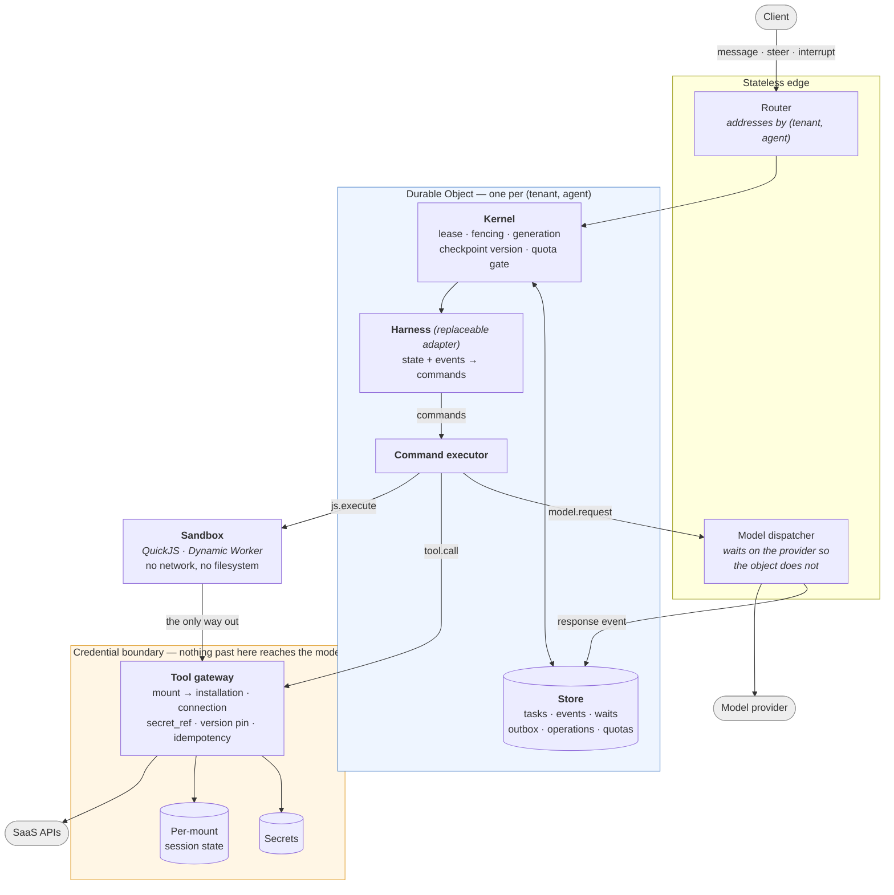

# agent-harness

A durable, multi-tenant runtime for agents that act on real systems.

The agent loop itself is commodity — bring your own, or use the reference one.
What this provides is everything underneath it: an agent that survives a crash
and resumes, tenants that are isolated by addressing rather than by a `WHERE`
clause, budgets that actually stop a runaway loop, and one property the rest of
the design is built around:

> **The agent acts on your systems, and its context never contains your keys.**

## Why that claim is the interesting one

Most agent setups put credentials in the model's context — an API key in the
prompt, an OAuth token in a tool result, or a tool that fetches one. That makes
prompt injection a credential-exfiltration path, puts tokens through the model
provider and the logs, and leaves no clean answer to "who did this, under whose
authority".

The benchmark that demonstrates the alternative is [AppWorld][appworld]: 9 apps,
457 APIs, **362 of them (79%) behind an access token**. AppWorld's own interface
expects the agent to read the supervisor's passwords, call each app's `login`,
and carry the token itself. Here the nine apps are nine ordinary mounts:

| | AppWorld's native interface | This runtime |
|---|---|---|
| Where credentials live | the agent's context | `secret_ref`, dereferenced server-side |
| Who logs in | the agent | the gateway |
| Where the token is kept | the agent's context | the mount's connection state |
| What the model sees | passwords, tokens, Python | `spotify.show_song({song_id})` |

Nine end-to-end cases assert it against the live servers: no schema mentions
`access_token`, the credential-reading tool is not mounted, an authenticated
call succeeds without the agent ever logging in, and the token never appears in
a tool result.

[appworld]: https://github.com/StonyBrookNLP/appworld

## Architecture



Three things the picture is meant to make obvious:

1. **The sandbox has exactly one exit.** It has no network and no filesystem;
   the only thing it can do is call the gateway, which decides what that means.
2. **Credentials sit on the far side of the gateway.** The model produces a
   mount alias and arguments. It never produces, sees, or stores a credential.
3. **The object is the tenant boundary.** Two tenants are two Durable Objects
   with two SQLite databases, so cross-tenant data is not in the database being
   queried — and the object refuses an identity that is not its own.

### The step

Every advance passes four gates before anything is written:

```
lease (fencing token)  →  generation  →  checkpoint version  →  tenant quota
     fenced              stale_generation   version_conflict     quota_exceeded
```

Commands go to a transactional outbox with **derived, not random** ids
(`sha256(taskId|generation|version|index|kind|payload)`), so replaying an
advance after a crash produces the same ids and the insert collapses. Operation
ids are derived the same way, so a replayed *write* is answered `unknown` — it
may already have landed — instead of being performed twice.

## Storage

One contract, two implementations, no third:

| Backend | Where | Kernel contract |
|---|---|---|
| `SqliteStore` | in-process (Node) | 20/20 |
| `DurableObjectStore` | Cloudflare | 20/20 |

A db9/Postgres backend also passed, and was removed: 61,219 ms against sqlite's
162 ms, no `SERIALIZABLE`, and `40001` on plain concurrent inserts. A backend
that passes but is never run is a liability, not an asset — it has to be updated
on every seam change while nobody exercises it.

## What is verified

Contracts, not assertions in prose. `test/spec/` runs unchanged against every
backend and every sandbox.

| Suite | Cases | Covers |
|---|---|---|
| `spec/kernel-spec` | 20 | crash before/after commit, fencing, stale generation, lost wakeup, duplicate delivery, cross-tenant, connection state, checkpoint budget, quotas (incl. no double-spend under concurrency), replay |
| `spec/executor-spec` | 9 | isolation, budgets, cancellation, output caps, escape reachability |
| `tools` | 10 | mount addressing, ambiguity, version pinning, `unknown` semantics, replay |
| `narrowing` · `cache-invariants` | 17 | tool disclosure, prompt-prefix stability |
| `model-binding` | 6 | whose key an agent spends |
| `harness` · `steering` · `api` | 22 | compaction, interrupts, HTTP surface |
| `appworld` | 9 | credential custody at 457 APIs (needs a licensed install) |

Live checks on the deployment: `/isolation`, `/eviction`, `/model-binding`.

## Layout

```
src/core/         seams: store, execution, tools, types
src/runtime/      kernel, gateway, command executor, sandbox, model resolver
src/harness/      reference harnesses (replaceable — this is not the product)
src/plugins/      plugin contract, built-ins, AppWorld
src/store/        sqlite, durable-object
cf/               Cloudflare deployment
bench/            τ²-bench, AppWorld, cache and selection probes
test/             suites; test/spec/ is backend-agnostic
```

## Running

```bash
node --experimental-strip-types test/conformance.ts   # kernel contract, sqlite
node --experimental-strip-types test/tools.ts         # gateway
cd cf && npx wrangler deploy                          # Cloudflare
```

AppWorld needs a licensed local install; see [`bench/appworld/README.md`](bench/appworld/README.md).
Its catalogue is **not** committed — that data may only be redistributed encrypted.

## What is not done

Stated plainly, because a runtime that hides its gaps is worse than one that has
them:

- **Event retention.** Storage grows without bound; a genuinely long-running
  agent will exhaust one object.
- **Plugin lifecycle.** Mounts can be created but not updated, disabled or
  revoked.
- **External events.** Nothing can wake an agent from the outside yet — no
  webhooks. That is half of "long-running".
- **Policy.** The gateway checks that a mount exists and its version matches. It
  does not yet do per-mount scopes or approval gates on writes.
- **Benchmarks are not scores.** The numbers here are single-trial ablations at
  n=3–8, and τ²-bench scoring does not implement the official `NL_ASSERTION`
  axis. They detect direction, not rank.
