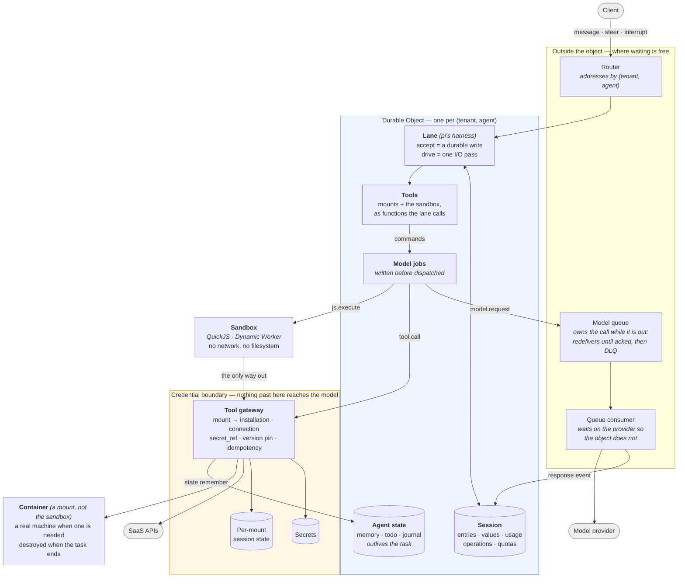

# antiproton

A durable, multi-tenant runtime for agents that act on real systems, on
infrastructure that costs nothing while nobody is asking it anything.

The agent loop itself is commodity — bring your own, or use the reference one.
What this provides is everything underneath it, and it is built for four things
at once:

- **Multi-tenant, structurally.** Two tenants are two Durable Objects with two
  SQLite databases. Cross-tenant data is not in the database being queried, so
  isolation does not depend on remembering a `WHERE` clause.
- **Server-side.** No laptop, no `.agent` directory, no process to keep alive.
  An agent survives a crash, an eviction and a deploy, and resumes.
- **Scale to zero, pay as you go.** An idle agent runs nothing: no process, no
  poller, no armed timer, no container. It costs storage and nothing else, and
  the next message rebuilds it from its log.
- **The agent never holds a credential.** It acts on your systems, and its
  context never contains your keys.

## Costing nothing while idle

Scale-to-zero is easy to claim and easy to lose one careless `await` at a time,
so the numbers below are measured on the deployment rather than reasoned about.

Durable Objects bill **wall-clock duration while the object is active**; Workers
bill **CPU**, and time spent waiting on I/O is free. A model call is five to
sixty seconds of pure waiting. Awaiting it inside the object means paying for
the wait; that one distinction drives most of the design.

| | Measured |
|---|---|
| Model call awaited inside the object | 128.2s of billed object time |
| The same work, awaited off it | **0.7s** |
| One agent, 79 model calls | 40.8s billed inside vs **709.2s waited outside** (582.5s of it the provider) |
| Idle agent | no invocations, no armed alarm, no container |

Three things had to be true for the last row, and each was a bug first:

- **The alarm stands down.** It used to re-arm every 30 seconds for the life of
  the object. An idle object now deletes its alarm and wakes only when something
  arrives.
- **Nothing polls.** Work in flight belongs to a queue, which redelivers until
  acked and gives up into a dead-letter queue. The object does not stay awake to
  supervise it. (It used to: the sweeper, the give-up timer and the re-dispatch
  loop were a hand-rolled reimplementation of one line of a queue's contract.)
- **The sandbox is handed back.** A container is destroyed when the task ends,
  not stopped — `stop` returns 200, leaves the box and its storage in place, and
  keeps billing. Thirteen boxes were live before that was noticed.

The other half of cost is tokens, and the number that decides it is prompt-cache
hit rate. Measured here: editing the system message drops it from **84.9% to
0.0%** — 6.6x the uncached tokens — while editing the tool block costs 1.1x. So
the agent's memory is injected once when a task opens rather than before every
turn, which is where a local harness would put it. The console draws the cache
hit per call, so losing it is visible rather than merely expensive.

The cache is not the whole story, though: on a long investigation it sits above
99% and the bill still climbs, because each fetched page is re-sent on every
subsequent turn. That is what compaction is for, below.

## The security claim

> **The agent acts on your systems, and its context never contains your keys.**

Most agent setups put credentials in the model's context — an API key in the
prompt, an OAuth token in a tool result, or a tool that fetches one. That makes
prompt injection a credential-exfiltration path, puts tokens through the model
provider and the logs, and leaves no clean answer to "who did this, under whose
authority".

The benchmark that demonstrates the alternative is [AppWorld][appworld]: 9 apps,
457 APIs, **362 of them (79%) behind an access token**. AppWorld's own interface
expects the agent to read the supervisor's passwords, call each app's `login`,
and carry the token itself. Here the nine apps are nine ordinary mounts:

| | AppWorld's native interface | This runtime |
|---|---|---|
| Where credentials live | the agent's context | `secret_ref`, dereferenced server-side |
| Who logs in | the agent | the gateway |
| Where the token is kept | the agent's context | the mount's connection state |
| What the model sees | passwords, tokens, Python | `spotify.show_song({song_id})` |

Nine end-to-end cases assert it against the live servers: no schema mentions
`access_token`, the credential-reading tool is not mounted, an authenticated
call succeeds without the agent ever logging in, and the token never appears in
a tool result.

[appworld]: https://github.com/StonyBrookNLP/appworld

## Architecture



Four things the picture is meant to make obvious:

1. **The sandbox has exactly one exit.** It has no network and no filesystem;
   the only thing it can do is call the gateway, which decides what that means.
2. **Credentials sit on the far side of the gateway.** The model produces a
   mount alias and arguments. It never produces, sees, or stores a credential.
3. **The object is the tenant boundary.** Two tenants are two Durable Objects
   with two SQLite databases, so cross-tenant data is not in the database being
   queried — and the object refuses an identity that is not its own.
4. **A container is a mount, not a loophole.** Work that genuinely needs a real
   machine gets one, but it is reached the same way a SaaS API is — through the
   gateway, under the mount's policy — rather than by loosening the sandbox. It
   holds no credential of the agent's, and it is destroyed when the task ends.

### Policy, and the gate

A mount carries a policy — `{read, write, tools}`, each `allow`, `deny` or
`approval`. A denied tool never reaches the plugin. A call marked `approval`
is not performed: the operation is recorded, the task **parks on it**, and a
person sees the request verbatim and signs it. The decision wakes the task,
and the call is then performed exactly once.

The parking matters more than it sounds. Answering a held call with an error
made the agent announce it could not proceed and stop; told instead that it is
paused and a decision is coming, the same task went from a 75s failure to a
17.2s success. Two mounts of one plugin can carry different policies, which is
how two accounts of the same SaaS get different authority.

### The step

Admission and work are separate calls, and that separation is the design:

```
accept()   a pure write — the message is durable before anything is answered
drive()    one I/O pass — returns `waiting` rather than blocking
resume     the next alarm picks up whatever was left open
```

`accept` returns at once, so a person's message survives a crash that happens
before the model is even asked. `drive` never waits for a model: the provider
here answers `deferred` with a handle, the operation suspends durably, and the
object stops being active while the queue does the waiting. Nothing needs a
lease or a fencing token, because a Durable Object is single-threaded and pi's
mutation line serialises the writes — there was never a second writer for them
to protect against.

Effects the object cannot re-run safely are marked. A tool declares
`sideEffects` and `idempotency`, which becomes pi's `replay: "never" | "safe"`:
a read repeats freely, a write repeats only if the plugin can make it
idempotent, and everything else is answered `unknown` rather than performed
twice.

### Tools are called the provider's way

The harness offers the mounted tools through the provider's own tool-calling
channel and reads `tool_calls` back. That sounds like a detail and is not.

The alternative — asking the model, in prose, to reply in a convention invented
here — was the default until a model change broke it in public. A model under
any pressure falls back to the format it was trained on, and every provider
trains a different one. Four turned up in two days: `<tool_call>`, `<invoke>`,
an invented `<system name="...">`, and DeepSeek's DSML written with full-width
bars. Each arrived as another branch in a regex, and each time the harness had
read the markup as a finished answer and ended the task mid-job.

Measured on the same model, prompt and task: through the invented convention,
16s, one model call and no tool calls at all — it emitted markup, the harness
took it for an answer, and it replied from memory against an explicit
instruction not to. Through the provider's channel: 91s, twelve model calls,
thirty tool results, and an answer that had read the repository.

The invented convention is gone with the harness that used it: pi's loop calls
tools through the provider's channel and nothing else, so there is no regex left
to teach.

## Keeping the context small enough to think in

A long investigation outgrows any context window, and what it has learned is
the part worth keeping. Dropping old turns keeps the task alive and throws the
findings away.

So, following [pi][pi] — see [what was taken from elsewhere](#what-was-taken-from-elsewhere) —
walk back from the newest message to a budget and keep
that tail verbatim; summarise everything before it into a handover with fixed
sections — goal, constraints, progress, decisions, next steps; truncate tool
output hard, or the summariser summarises a fetched page instead of the work;
and on a second pass feed the previous handover back with an update prompt that
says to merge rather than append.

Four triggers, two of them estimates and two facts. A share of the model's
context window, and a share of the checkpoint budget — both estimates, and both
expressed as fractions, because the same token count is most of a small window
and a rounding error in a large one. Then the two certain ones: the provider
refusing the call because the prompt does not fit, which forces a compaction
rather than a retry that cannot succeed; and a person pressing **compact now**.

It fits here better than it fits pi, because the harness holds no I/O:
compaction is a command like any other. The request declares its purpose, so
the reply is a record in the log of where a compaction happened and what was
folded up.

Nothing is destroyed. `state = fold(events)`, the log is untouched, and only
what the model is shown gets shorter — the console says so where it happened.

Demonstrated end to end: compaction fired on its own, produced a handover with
the goal and per-page progress intact, and the agent then answered two questions
whose answers had been fetched *before* the compaction, without going back to
re-read anything.

## Remembering

An agent that cannot write anything down re-derives everything on every task,
and it knows it: asked to keep a note, this one used to answer that it had
nowhere to keep one. It now has its own store, per `(tenant, agent)`, outliving
any single task — small values in the object's SQLite, large ones spilled to
object storage behind an `r2://` reference the existing reader can page.

The shape follows what [pi-memory][pim] and Codex arrived at independently:
plain text documents a person can read and correct, separate documents for
separate lifetimes (`memory` for durable facts, `todo` for what is open,
`journal` for what happened), and appending in one call — a journal you have to
read, edit and rewrite to add a line is a journal that stops being written.

The load-bearing part is theirs too: the working set is **pushed into the
prompt**, not left to be pulled, because an agent that has to remember to go and
look will not look. What does not carry over is doing it before every turn. That
is affordable in a local CLI and not here — see the cache numbers above — so it
is injected once when the task opens, where the prefix stays stable and cached.

Demonstrated across two tasks: told a deploy window, a formatting preference and
an unhandled certificate expiry in one, then asked in a *new* task when to ship,
it answered with the next Tuesday's date at 02:00 UTC, raised the certificate
unprompted, and formatted the reply the way it had been asked to.

[pim]: https://github.com/jayzeng/pi-memory

## Storage

One contract, two implementations, no third:

| Backend | Where | pi storage conformance |
|---|---|---|
| `PiSqliteStorage` on node:sqlite | in-process (Node) | 21/21 |
| `PiSqliteStorage` on DO SQLite | Cloudflare | 21/21 |

A db9/Postgres backend also passed, and was removed: 61,219 ms against sqlite's
162 ms, no `SERIALIZABLE`, and `40001` on plain concurrent inserts. A backend
that passes but is never run is a liability, not an asset — it has to be updated
on every seam change while nobody exercises it.

## What is verified

Contracts, not assertions in prose. The storage contract runs unchanged against
both backends, and it is not ours — it ships with pi, which is the point of
implementing pi's interface rather than copying its design.

**The measurement standard: a figure counts as measured only when it was taken
on the real serverless environment** — the Durable Object, not a Node process
and not in-memory SQLite. A number from anywhere else is reported only if it is
labelled as in-process, and never in place of an on-object one. This is why the
SWE-bench rows below say which environment produced them.

| Suite | Cases | Covers |
|---|---|---|
| `pi-storage` | 21 | pi's own storage conformance, unchanged, on node:sqlite (`npm run pi-storage`) and on Durable Object storage (`npm run pi-storage:do`, a worker that is never deployed): mixed-write atomicity, rollback across every store, value and list ordering within a transaction, branch stops before filters and cursors before limits, admission order under concurrent commits, close that seals admission but drains what it admitted |
| `pi-agent` | 8 | the object-side loop: a message is a pure write, a pass suspends rather than waits, a tool turn goes model → gateway → model, a duplicated pass does not grow the transcript, a run is not dispatched twice, the alarm does not poll, and a run interrupted by eviction is reported open and finished |
| `pi-offload` | 3 | the object never waits for the model: drive suspends, the answer resumes the same operation, and a suspension survives eviction |
| `pi-tools` | 7 | mounts as tools: the gateway is still the only way out, a refusal reaches the model as a refusal, replay policy, and names the provider will accept |
| `pi-loop` | 3 | pi's harness on our storage, and a rebuilt harness finding the transcript again |
| `pi-bridge` | 5 | pi's request shape against our provider client, both ways |
| `executor` · `http-plugin` | 19 | sandbox contract in-process (`executor` 9 runs the `spec/executor-spec` rows), fetch and HTML extraction (`http-plugin` 10) |
| `state` | 7 | memory that survives a task, byte budgets, per-agent isolation |
| `markdown` | 7 | the console renders the agent's markdown and never its HTML |
| `model-binding` | 6 | whose key an agent spends |

Benchmarks are not tests and are reported separately, because they measure a
model as much as a harness. Each row says which environment produced it: only
the on-object ones meet the standard above, and the in-process ones are marked
as such. SWE-bench Verified, the same three astropy
instances each time:

| | model | resolved | wall clock | prompt tokens | measured in |
|---|---|---|---|---|---|
| the previous harness | deepseek-v4-pro | 1/3 | 699 s | 307 k | Node process, in-memory SQLite |
| pi's loop | deepseek-v4-pro | 2/3 | 1,044 s | 1,647 k | Node process, in-memory SQLite |
| pi's loop | deepseek-flash | 3/3 | 690 s | 550 k (94% cached) | Node process, in-memory SQLite |
| pi's loop | **deepseek-flash** *(deployed model)* | **3/3** | 692 s | 446 k (93% cached) | **Durable Object** `bench-swe1`, 2026-09-10, `swe-on-object` |

The first two rows compare loops; the last two change the model as well, and
are here because it is the model the deployment runs. Only the last row meets
the standard: it was driven through the deployed Worker (`bench/swebench/cf.ts`),
the agent ran inside the object with the instance's image mounted as its
machine, the model calls went through the production queue, and the grader ran
in the same container before the runner released it. Same score and wall clock
as the in-process row, about a fifth fewer tokens, and one number the Node
process could not produce at all: **the object was billed for 516 s of the 692 s wall clock
(75 %)**, 28 s of it the runner grading. τ² bills the object for 3 % of wall
clock; SWE-bench bills it for 75 %. The difference is where the waiting
happens: a model call leaves the object through the queue, but a tool call runs
inside it, and this task is 49 shell commands in a container, the first of them
a 75-second image pull. That is a property of what ships, measured rather than
argued, and not something this change fixes.

Prompt tokens alone overstate the bill by more than ten times: of the 446 k in
the last row, about 30 k were actually re-read. An append-only transcript earns
that — each turn adds to the tail and leaves the prefix untouched, which is the
shape a provider cache rewards.

Across all three instances, in the in-process run (53 tool calls) and the
on-object one (49), `run_js` was used **zero** times. The same is true of τ²:
on the object it went unused across 24 trials. The one run that reached for it
— twice — was an in-process matrix, which is not on-object evidence. This task
is shell work inside a container, and the sandbox earns its place by replacing
several calls with one; neither benchmark is the shape that tests it, and the
sandbox is not yet shown to pay on this substrate.

Two runs of the same commit on the same model scored 3/3 both times and differed
by a third in cost — 1,071 s / 813 k against 690 s / 550 k. That is the size of
the noise, and it is worth knowing before reading any single figure as a trend.

The score is not the interesting number. Both instances the old loop failed
ended after **one model call** — it was not the model failing the task, it was
the loop stopping. The new one works them for eleven to fifty-nine turns.

A single instance is a coin flip: `astropy-12907` passed alone, failed in a
slice, and passed again on another model, all with the same code. Three
instances measure that the loop runs, not how good it is.

## What was taken from elsewhere

The harness is the commodity part of this, and the parts of it that are good
were mostly worked out by other people. Naming what came from where, because a
reader deserves to know which decisions were reasoned from first principles and
which were copied from someone who had already made the mistake.

**[pi][pi]** (MIT, © Mario Zechner) is the main source, and the debt is
specific rather than atmospheric:

- **Compaction.** Walk back from the newest message to a budget and keep that
  tail verbatim; summarise everything before it into a handover with fixed
  sections; truncate tool output hard so the summariser summarises the work
  rather than a page it fetched; and on a second pass feed the previous
  handover back with an *update* prompt that says to merge rather than append.
  The prompts here are written fresh but the structure is theirs.
- **Push the working set in rather than trusting recall.** Both pi-memory and
  compaction rest on it: an agent that has to remember to go and look will not
  look. What did not carry over is doing it before every turn, which the cache
  economics here forbid.
- **Separate documents for separate lifetimes** — durable facts, open items,
  a running log — so the working set can be trimmed by priority.
- **Steering as distinct from aborting.** A message sent while the agent works
  reaches the model before its next call and stops nothing in flight; a
  follow-up waits until it has finished. Two gestures, not one, and the default
  is the first. I had these confused until pi's definition corrected me.
- **Per-model configuration rather than one deployment-wide number.** pi keeps
  context windows and provider quirks in `models.json`. The same shape is used
  here, and adopting it immediately found a live misconfiguration: compaction
  was calibrated for a 131k window on a model that holds a million.

**[Codex][codex]** for the distinction between static instruction and learned
memory — `AGENTS.md` is configuration and does not learn — and for redacting
secrets before anything is written down.

- **The durable storage contract.** `src/store/pi-storage.ts` implements pi's
  `Storage` interface on SQLite, and `test/pi-storage.ts` runs pi's own
  `createStorageConformance` suite against it — 21 cases, unchanged, on both
  node:sqlite and Durable Object storage. Implementing someone else's interface
  buys an executable specification for the part of a session store that is
  hardest to test honestly: mixed-write atomicity, rollback across four tables,
  cursor-before-limit ordering, admission order under concurrent commits. Our
  own tests encode our own assumptions, which is exactly why they would not have
  caught these. The suite runs in a worker that is never deployed: bundling it
  into the real one grew the production binary by 58 KB, of which the storage
  implementation itself is 500 bytes. A multi-tenant Worker should not pay for a
  test suite on every cold start. The usage arithmetic in that file is derived
  from pi's `harness/utils/usage.js`, which its export map does not publish.

That last item revises what this section used to say. It claimed the shape of
the agent loop was deliberately not borrowed, because pi was a local,
single-tenant tool where a shell is a reasonable thing to hand a model. As of
0.85 that is no longer true: `pi-agent-core` splits durable admission
(`accept`) from an I/O pass (`drive`), and describes its unit of change as "one
effect-free decision made on a lane's serialized mutation line" — the same split
this project's own kernel arrived at independently, before that kernel was
deleted in favour of pi's loop. The storage layer came first; the loop above it
followed, and both are pi's now.

[pi]: https://github.com/badlogic/pi-mono
[codex]: https://developers.openai.com/codex

## What is not done

Stated plainly, because a runtime that hides its gaps is worse than one that has
them:

- **Event retention.** Snapshots are written and pruned, so rebuild stays
  bounded — but the event log itself is never trimmed. This is the one hole in
  the idle-cost claim above: compute really does go to zero, and storage really
  does not, so a genuinely long-running agent's floor rises for ever and will
  eventually exhaust one object's 10 GB.
- **Plugin lifecycle.** A mount's config and policy are reconciled on every
  visit, so drift self-heals. Disabling and revoking one is still missing, as
  is any notion of installing a plugin at runtime.
- **External events.** Nothing can wake an agent from the outside yet — no
  webhooks. An agent now remembers across tasks, but it still cannot be woken
  by the world; that is the remaining half of "long-running".
- **One object per (tenant, agent).** That is what makes isolation structural,
  and it is also the ceiling: one agent's work does not shard.
- **The context window is configuration.** Compaction is a share of it, so a
  model change that forgets to bring `HARNESS_CONTEXT_WINDOW` with it calibrates
  against the wrong number. Unset assumes a small window, which compacts early
  rather than discovering the limit from a refused call — but nothing reads the
  real value from the provider.
- **Benchmarks are not scores.** The numbers here are single-trial ablations at
  n=3–8; τ²-bench scoring does not implement the official `NL_ASSERTION` axis,
  and the SWE-bench Verified runs are a handful of instances, not a submission.
  They detect direction, not rank.
