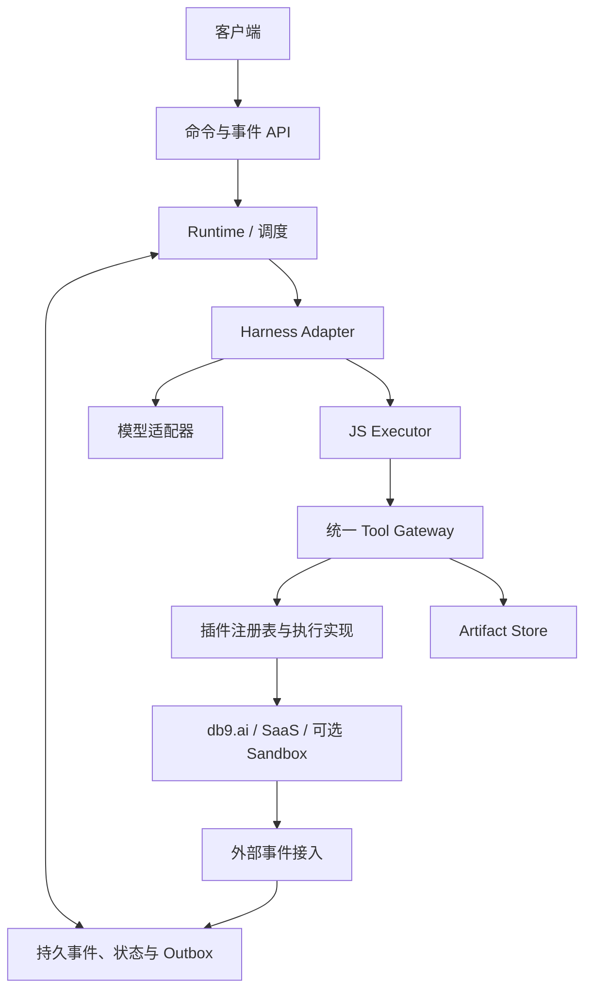

# 服务端 Antiproton：完整项目计划书

> **归档说明（2026-09-10，入库时补写）**
>
> 本文在任何代码之前写成，作为设计基线保留，**正文不改**。它记录了当时的判断、
> 备选方案和实测证据 —— 这正是它的价值，也是它不可当作现状读的原因。
>
> **现状以 [`README.md`](../README.md) 为准。** 本文与 README 冲突之处，一律以 README 为准。
> ⚠️ 特别地，本文 §13 的 P1 路线与 §14 验收矩阵仍以租约（lease）、fencing token、
> generation、事务 outbox 为交付项；这些机制在采用 pi 的循环后已被删除（见 `README.md`
> 与 [`pi-upstream.md`](pi-upstream.md)）。保留原样是为了记录它们曾被如何论证，不是因为它们还在。
> ⚠️ 同样地，正文 §10 的状态表仍把 `src/api/server.ts` 列为 ✅；该文件与其 node 侧 HTTP 服务已在
> Worker 实现取代后被删除（#276，2026-09-13）。保留原样是为了记录它曾被如何论证，不是因为它还在。
>
> 姊妹文档：[`本地自托管Antiproton-计划书.md`](本地自托管Antiproton-计划书.md)（第二种部署形态）。

> **状态说明（2026-09-09）**
>
> 这是一份**设计文档**，写在实现之前，保留原样是为了记录判断过程和当时的证据。
> 其中相当一部分已经实现并被实测追平，也有若干处已被实现推翻。
>
> **当前事实以仓库 `README.md` 为准** —— 那里的每个数字都是重新测过的，包括
> 已完成的部分、明确的缺口，以及线上可自证的端点。本文里与之冲突的表述，以 README 为准。
>
> 本文写作之后发生的主要变化：模型调用改由队列承载（不再是 `waitUntil`）；工具调用改走
> provider 原生通道；加入了 agent 自己的状态存储与 pi 式摘要压缩；前端从演示页改成调试控制台。


版本：v1.1 实施验证基线
日期：2026-09-06
状态：P1/P2 核心已实现，20 项一致性用例通过；其余章节仍为设计建议
项目名称：待定
代码位置：`~/antiproton`（Node 24 + TypeScript，运行时零依赖）

### 相对 v1.0 的变更

| 变更 | 依据 |
|---|---|
| db9.ai 明确为 Serverless Postgres；Runtime 热路径改用自建事务存储 | 读其官方 skill.md；其自述 ~30 ops/s、RTT 100–200ms |
| 新增 Agent 面向 db9 时必须禁用 `http` / `fs9` / `pg_cron` 的硬约束 | 否则 Agent 可从 SQL 直接发外网请求，绕开 Tool Gateway |
| 工具调用改为 mount alias 寻址，参数对象只含业务字段 | 配置期绑定后 connection 不应再作为调用参数 |
| 结果协议收敛为单一通道，新增 `rejected` 状态 | 双通道会迫使每段 Agent 代码同时 try/catch 与判断 status |
| command_id 必须由 (task, generation, version, 序号) 派生 | 崩溃后重跑 advance 会重新生成命令，随机 ID 令去重失效 |
| Artifact Store 选定 Cloudflare R2 | 实测小对象 PUT 252ms、5MB 497ms、预签名 GET 93ms |
| 任务状态新增终态 `failed` | `blocked` 非终态，永久失败的任务无处安放 |
| 数据模型：tenant_id 下沉到每张表；游标独立成记录；operation 补归属字段 | 多租户隔离与卸载清理需要按 agent/task 反查 |
| 新增"已解决 wait 的清理"与"统一事件唤醒通道" | 实现时发现 resolved wait 会永久阻止任务回收 |

## 1. 项目定位

构建一个持续存在、能够承担工作和使用外部服务的服务端 Agent。它拥有身份、记忆、交流上下文和工作进度，可以等待、被打断、接收新消息并继续行动，不要求拥有一台常驻或性能强大的电脑。

交互能力接近 ChatGPT，同时具备接近 Codex / Claude Code 的实际工作能力。Agent 的能力主要来自 SaaS、数据服务和外部工具；Linux sandbox 是必要时取得的计算资源。

核心工程目标是：**长期存在的 Agent、短生命周期的执行、可靠的持久状态、统一可追踪的工具调用。**

本计划书整合前序架构讨论并替代其中已修正的建议：不恢复 JS 内部状态，不为 Agent 设计通用 KV 状态层，不强制引入 HumanRequest，不将普通 SaaS SDK 函数作为标准工具入口。

## 2. 已确定的需求与设计边界

| 事项 | 当前约定 |
|---|---|
| 运行形态 | 多租户服务端 Agent |
| Long-running | 任务和身份跨执行持续存在，支持长时间等待与恢复 |
| Scale to zero | 无可执行工作时回收对应执行资源，持久存储保留 |
| Linux / Bash | 核心 Agent 无需 Linux sandbox，不默认暴露 Bash；Linux 能力通过可选外部工具取得 |
| JS 生命周期 | 每次执行新建环境；变量、闭包、调用栈和 Promise 不跨执行保存 |
| Agent 业务状态 | db9.ai（Serverless Postgres），Agent 自行组织 schema |
| Runtime 事务数据 | 独立事务存储（sqlite / Durable Object），不走 db9.ai 热路径 |
| Artifact | Cloudflare R2；数据库只保存 `r2://` 引用 |
| Trajectory | Runtime 自动保存；Agent 可按权限读取，不能改写原始历史 |
| 工具入口 | 统一 tagged template；工具名寻址 mount alias，参数对象仅含业务字段 |
| 插件 | 动态发现、渐进展开、热安装、更新、停用和卸载 |
| SaaS | 方便接入外部服务，支持同一服务的多个账号连接 |
| Steering | 工作中追加消息、中断；消息接收不依赖当前执行是否结束 |
| 框架解耦 | Runtime 提供可靠运行，具体 harness 决定推理和工作策略 |
| 人的参与 | 普通文本消息足够；不把 HumanRequest 设为必需原语 |
| Agent OS | 保留事件、等待和唤醒基础；完整 OS、App Store、身份体系分阶段考虑 |

### 2.1 已实测确认的事实

| 事项 | 实测结论 |
|---|---|
| **db9.ai 真实形态** | **不是 PostgreSQL，是 TiKV 之上的 PostgreSQL 16 兼容层**（`db9-server 0.1.0 on TiKV`）。带 JSONB、pgvector、全文检索、`pg_cron`、`http`、`fs9`、分支、Secrets API、pgwire 直连 |
| db9 支持的原语 | 条件更新+RETURNING、`ON CONFLICT DO UPDATE`、`FOR UPDATE SKIP LOCKED`/`NOWAIT`、部分唯一索引、序列、可写 CTE、advisory lock、JSONB、identity 列——**均可用** |
| db9 不支持 | **`SERIALIZABLE` 隔离级别**（服务端明确拒绝，只允许 REPEATABLE READ / READ COMMITTED） |
| db9 并发行为 | 并发 16 时，**主键互不相同的普通 INSERT 也会报 `40001 could not serialize access due to concurrent update`**（Percolator 写冲突透出）。客户端必须实现 40001 重试 |
| db9 实测延迟 | `SELECT 1` 往返 87ms；单行 INSERT 110ms；**两语句事务 374ms**（正是一次 advance 的形状） |
| db9 实测吞吐 | 9.1 ops/s（1 连接）、26.4（4）、40.5（8）；16 连接写冲突失败 |
| **同套用例双后端** | §14 的 12 项内核一致性用例在 SQLite 与 db9 上**均全部通过**；墙钟 **162ms vs 61,219ms（378 倍）** |
| Artifact Store | R2 小对象 PUT 252ms / 5MB PUT 497ms / 预签名 GET 93ms；未签名请求被拒；前缀列举生效 |
| 开发期模型 | DeepSeek（OpenAI 兼容），`deepseek-v4-pro` / `-flash`；function calling 正常；70 万 token prompt 被接受；`max_tokens` 上限 393216 |
| 模型陷阱 | `max_tokens` 包含 reasoning tokens，设小会导致 `content` 为空且 `finish_reason=length` |
| 实现底座 | Node 24 直接执行 TypeScript（strip-only，不支持参数属性），`node:sqlite` 内置 |

### 2.2 尚未确定、不得视为承诺的选型

生产模型提供方、仓库归属和协议兼容范围尚未选定。尚未完成压力测试与故障恢复验收。

> 以下三条在本文写作时是未定项，现已结清，保留原文只为记录判断过程：QuickJS 已完成嵌入并作为
> `executor-spec` 的实现之一(9/9)；Cloudflare 迁移已完成并线上运行；部署已完成。

### 2.3 第一版不承担的范围

不做任意 JS 透明恢复、调用栈快照、默认 Bash、完整 Node/npm 兼容层、完整 App Store、复杂 App 开发框架、独立 Agent identity 基建、通用人类审批工作流。用户授权可通过文本链接和插件实际授权状态完成。
## 3. 产品模型：一个持续存在的主体

| 对象 | 含义 | 关键关系 |
|---|---|---|
| Agent | 身份、配置、插件安装、账号连接和整体工作视野 | 归属租户，可关联多个 Thread 和 Task |
| Thread | 一个交流场所及其上下文 | 可讨论多个 Task |
| Task | 一项工作、目标或承诺 | 可关联多个 Thread 和 operation |
| Inbox | 待处理消息和外部事件 | 归属于 Agent，保留来源与目标关联 |
| Activation | 一段实际思考和行动 | 可回收，不承载身份唯一性 |
| Execution | 一次模型请求或 JS 执行 | 归属 Activation、Task 和 generation |
| Operation | 一项可追踪的外部操作 | 可跨 Activation 存活 |
| Installation | 某个 Agent 或租户安装的插件实例 | 关联插件版本和授权策略 |
| Connection | 一个外部账号连接 | 与 Agent ID、插件身份分离 |

### 3.1 并发策略

建议第一版允许一个 Agent 同时承担多个 Task，但默认只有一条主要决策流；外部 operation 可以并行。Agent 等待一项工作时可以处理另一项工作。

此约束属于初始调度策略，不应变成 Runtime 无法扩展的结构限制。Agent 级状态提交使用租约和版本控制；未来如支持委派或并行分支，需要显式定义各分支的写入范围与汇合方式。

### 3.2 任务状态

| 状态 | 含义 | 恢复条件 |
|---|---|---|
| runnable | 有可推进工作 | 获得调度 |
| running | 正被有效执行者推进 | 提交新状态 |
| waiting | 等工具、事件或消息 | 等待条件满足 |
| completed | 本次工作完成 | 新任务或明确重新打开 |
| interrupted | 用户或策略中断 | 明确继续或新指令 |
| blocked | 缺权限、资源或遇到不确定结果 | 解除阻塞 |
| failed | 永久失败，不再自动重试 | 明确重新打开 |

无运行实例是资源状态，不代表 Task 已完成。Task 状态不应承诺能自动判断任意自然语言目标是否真正达成。

## 4. 总体架构与职责



图中箭头表达逻辑调用与数据关系，不要求每个方框独立部署。部署初期可以合并可信控制组件，但 Executor 应有可独立回收和故障隔离的边界。

### 4.1 Runtime

负责消息持久化、可靠唤醒、租约、状态提交、operation 生命周期、取消、恢复、预算和客户端事件流。Runtime 不决定提示词、任务规划或上下文压缩策略。

### 4.2 Harness

决定如何构造模型上下文、调用模型、解释结果、运行 JS、处理新消息、切换任务和结束工作。自身必须能导出恢复所需的显式 checkpoint。

### 4.3 JS Executor

运行 Agent 生成的临时代码，暴露统一工具标签和输出接口，驱动异步 Promise，执行时间、内存、并发和输出限制。可信 harness 不必运行在该 JS 环境中。

### 4.4 Tool Gateway

所有 Agent 可见的外部工具行动经过此入口，包括 db9.ai、Artifact 操作、trajectory 读取、工具发现、插件管理和 SaaS 调用。统一处理身份、权限、解析版本、持久化调用、限流、追踪及结果引用。

Runtime 自身保存 trajectory、租约等内部数据库写入不走 Agent 工具入口，避免递归记录；这些内部行为单独记录诊断 span。

### 4.5 插件与最小 OS 能力

插件提供描述、实现、授权机制和可选外部事件。最小 OS 能力仅包括持久 Inbox、订阅、等待关系、可靠唤醒及简单调度。复杂的优先级策略、App Store 和身份服务保留扩展点。

## 5. Agent 编程界面

### 5.1 唯一工具调用骨架

绑定发生在配置期。安装插件、连接账号、选定版本之后，Agent 只面对一个 **mount alias**；调用里不再出现 connection、installation、租户等平台字段。

```js
const issues = await tool`gh_work.issues.list ${ { repo: "example/project" } }`;

if (issues.status !== "succeeded") {
  output({ problem: issues.status, error: issues.error });
} else {
  output(issues.result.map(i => i.title).slice(0, 10));
}
```

同一服务的第二个账号是**另一个 alias**，不是一个参数：

```js
await tool`gh_oss.issues.list ${ { repo: "example/project" } }`;
```

这样跨账号必须是一次显式书写，而不是一个可以漏填或写错的字段。

**语法规则（第一版）**

| 规则 | 说明 |
|---|---|
| 标签固定为 `tool` | 不引入第二个标签 |
| 工具名必须是模板首段的字面量 | 因此无法用循环动态派发一批工具，这是已知的表达力约束 |
| 第一个插值 = 参数对象 | 100% 归插件 schema，不含平台保留字 |
| 第二个插值（可选）= 调用选项 | `idempotencyKey`、`timeoutMs` 等平台字段的唯一出口 |
| 工具名后不得出现其他文本 | 多余文本、函数、循环引用、未约定的 BigInt 一律拒绝 |
| 参数出现 `connection` / `installation` / `tenant` / `agent` | 直接拒绝，并提示改用 alias |

```js
await tool`gh_work.issues.create ${ { title: "..." } } ${ { idempotencyKey: "task-1234" } }`;
```

无需 shell、不使用 eval 解释参数、不做 shell quoting。

**寻址与歧义**

| 情形 | 行为 |
|---|---|
| `alias.tool` 命中挂载 | 直接解析 |
| 裸插件名且只有一个挂载 | 解析 |
| 裸插件名且有多个挂载 | **拒绝**，返回候选 alias 列表，零派发 |
| 无对应挂载 | 拒绝，返回可交给人的授权链接 |

alias 是可改标签，operation 绑定的是 installation_id / connection_id / tool_version，改名不污染历史。

一个附带优势：模型只需要产出一段 JS 源码，语法正确性由 JS 解析器兜底，参数结构由 Gateway 校验——**整套设计不依赖模型提供方的 function calling**，因此弱模型和不同提供方都能驱动。

### 5.2 渐进式发现

```js
const found = await tool`tools.search ${ { query: "GitHub issues" } }`;
const schema = await tool`tools.describe ${ { name: "gh_work.issues.list" } }`;
output(schema.result);
```

启动上下文只提供 `tool` 的固定语法和少量基础工具说明。搜索与 describe 返回的都是 **mount 限定名**，并附带该 mount 的公开配置（绑的是哪个账号、默认组织等），模型才有依据选择 alias；凭证本身永远不出现。安装新插件不需要注入新函数或生成 SDK。

### 5.3 结果协议

**单一结果通道。** v1.0 让预受理失败抛 JS 异常、受理后失败走状态联合，等于要求每段 Agent 代码同时 try/catch 并判断 status，模型极易漏掉后者。现在收敛为：

```ts
type ToolResult =
  | { status: "succeeded"; operationId: string; result: Json }
  | { status: "pending" | "running"; operationId: string }
  | { status: "failed" | "cancelled" | "unknown"; operationId: string; error?: ToolError }
  | { status: "rejected"; error: ToolError };   // 从未受理，因此没有 operationId

interface ToolError {
  code: string;
  message: string;
  candidates?: string[];        // 歧义时给出可选 alias
  authorizationUrl?: string;    // 未挂载 / 未授权时给人操作
}
```

`rejected` 覆盖参数非法、歧义、未挂载、版本不符、权限不足等一切未生成 operation 的情况，**不虚构 operation ID**。只有宿主级程序错误才作为异常抛出。

短工具可在有限等待窗口内返回 `succeeded`；长工具返回 handle。`unknown` 表示外部影响尚不确定，不能直接自动重试。受理后的状态查询与取消也通过 tool 调用完成。

### 5.4 输出与上下文

output 是执行器的输出原语，不是另一个外部工具通道。宿主负责限制输出大小并可靠记录。模型默认接收显式输出、执行终态及必要的待处理 operation 提示，不自动接收所有中间工具大结果。

工具完整结果超过阈值时写入 Artifact Store，operation 只保留 `r2://` 引用（已实测：129KB 的 GitHub 结果落 R2，模型侧仅得摘要）。执行失败时向 harness 提供已成功的调用、结果引用和错误，避免 Agent 只看到最后的异常。
## 6. JS 引擎与宿主

### 6.1 初始实现建议

以 QuickJS 为候选，在 Executor Host 中嵌入。每次 execution 新建 JSRuntime 与 context，执行结束销毁；不以同一个 runtime 中的多个 context 作为租户隔离边界。

不注册文件系统、进程、Bash 或任意网络接口。db9.ai 和 SaaS 请求由插件实现执行。宿主绑定租户、Agent、Task 和权限上下文，拒绝脚本自报身份提升权限。

### 6.2 异步桥接

工具标签调用宿主 bridge，宿主创建 Promise 和调用记录；实际 I/O 在宿主异步系统中进行。返回后在所属引擎执行线程上兑现 Promise，并推进后续 JS jobs。等待 I/O 时不忙轮询。

本次 JS 存活期间可以 await 短调用。长任务返回持久 operation，脚本结束后由 harness 注册等待并释放 Activation。未 await 的普通 Promise 不构成持久后台任务；退出时取消未受理的宿主工作，已受理的 operation 继续跟踪，并出现在执行结果摘要中。

### 6.3 限制与中断

设置 wall time、引擎内存、栈、host call 总数、并发数、输入与输出体积上限。纯计算通过 interrupt handler 终止；宿主 I/O 等待通过取消信号解除。执行取消后 Gateway 拒绝新的调用，已受理外部操作按其能力取消或继续记录。

引擎内存限制不覆盖宿主响应缓冲，后者必须另设上限。QuickJS 的资源限制不能替代完整多租户安全边界；发布前需要进程故障隔离和资源耗尽验证。

### 6.4 执行器接口草案

```ts
interface JsExecutor {
  execute(
    input: {
      executionId: string;
      source: string;
      limits: {
        wallTimeMs: number;
        memoryBytes: number;
        maxHostCalls: number;
        maxConcurrentHostCalls: number;
        maxOutputBytes: number;
      };
    },
    host: {
      invoke(request: { tool: string; arguments: Json }): Promise<ToolResult>;
      emit(value: Json): Promise<void>;
    },
    signal: AbortSignal
  ): Promise<{
    status: "completed" | "failed" | "interrupted";
    acceptedOperationIds: string[];
    error?: { code: string; message: string; stack?: string };
  }>;
}
```

整段 JS 不视为事务，也不在失败后自动从头 replay。已完成数据库写入和外部副作用不会自动回滚。

## 7. 存储与持久化

### 7.1 三类存储职责

| 数据 | 负责方 | 依据 |
|---|---|---|
| 计划、知识、业务进度、中间数据 | db9.ai（TiKV 上的 Postgres 兼容层） | 低频、Agent 自行组织 schema、需要 JSONB/向量/全文检索 |
| Trajectory、Inbox、checkpoint、租约、operation、outbox | **独立事务存储（低延迟、与执行同机房）** | 热路径；db9 实测两语句事务 374ms、单连接 9.1 ops/s，一次 advance 就要 0.4 秒 |
| 文件、图片、大结果 | Cloudflare R2 | 实测 PUT 252ms / 5MB 497ms / 预签名 GET 93ms |

Runtime 不依赖 Agent 是否记得保存状态来保证消息和调用记录可靠。存储适配器接口（`src/core/store.ts`）是唯一接缝：任何通过 §14 一致性套件的后端都是候选，选型由测量决定。

**选型结论由测量得出，不是推演。** 两个后端跑的是同一个文件（`test/conformance.ts`，`HARNESS_STORE=postgres` 切换）：

| 后端 | 12 项一致性用例 | 墙钟 |
|---|---|---|
| SQLite（进程内） | 12/12 | 162 ms |
| db9（TiKV 上的 Postgres 兼容层） | 12/12 | 61,219 ms |

**正确性没有问题，代价在延迟。**

#### 决定：移除 db9 后端，只保留 sqlite 与 Durable Object

保留一个通过契约但从不使用的后端不是可选项，是负债——它要跟着每一次 `StorageAdapter` 变更同步修改，而且**没人真的跑它**。本轮新增的连接态、检查点上限、配额三组机制里，配额的 Postgres 实现就写完了没有实测过；这正是这类代码的典型下场。

依据是已经测过的数字，不是偏好：

| 后端 | 12 项内核契约 | 墙钟 | 处置 |
|---|---|---|---|
| sqlite（进程内） | 12/12 | 162 ms | **保留**（Node 侧） |
| Durable Object | 12/12 | 0 ms | **保留**（边缘侧） |
| db9（TiKV 上的 Postgres 兼容层） | 12/12 | 61,219 ms（378×） | **移除** |

加上 db9 的两条固有性质：不支持 `SERIALIZABLE`；并发 16 时主键互不相同的普通 INSERT 也会抛 `40001`。一次 advance 是两语句事务 = 374ms，单连接 9.1 ops/s。

**接缝本身保留并且更重要了**：两个通过同一份契约、实现方式完全不同的后端（一个进程内 SQLite，一个平台托管对象存储）已经足够证明它没有泄漏假设。删掉的是代码，不是抽象。

已删除：`src/store/postgres.ts`、`bench/db9.mjs`、`bench/roundtrips.mjs`、`bench/probe.mjs`，以及 `pg` 依赖。业务状态若日后仍要放 db9，那是**插件**的事，走 Gateway，不进内核热路径。

**db9 的两个性质影响设计：**

1. **不支持 SERIALIZABLE。** 我们的内核本来就不依赖可串行化——用 checkpoint_version 乐观并发 + fencing token 显式闸门，在 READ COMMITTED 下即可正确。这条设计选择因此被实证为对的。
2. **会在普通并发写上抛 40001。** 任何面向 db9 的适配器都必须带重试外壳。（此适配器已随上面的决定移除；若将来以插件形式接回 db9，这条约束依然成立。）

**Agent 访问 db9 的硬约束。** db9 库内可启用 `http`（从 SQL 发 HTTP）、`fs9`（从 SQL 读写文件）、`pg_cron`（注册定时任务）。若 Agent 持有裸 SQL 权限，这三者可让它绕过 Tool Gateway 直接发起外部请求、读写文件、注册 Runtime 看不见的调度——统一入口原则被击穿。因此：**Agent 面向的 db9 角色必须禁用这三个扩展，或 SQL 经 Gateway 白名单转发**。

### 7.2 Runtime 逻辑数据模型

| 记录 | 必要字段 |
|---|---|
| agents | tenant_id、agent_id、config、adapter_kind、version |
| threads | **tenant_id**、thread_id、agent_id、metadata |
| tasks | **tenant_id**、task_id、agent_id、status、generation、checkpoint_version、**fencing_token**、checkpoint |
| task_threads | tenant_id、task_id、thread_id、关联类型 |
| events / inbox | event_id、tenant_id、agent_id、task_id?、thread_id?、sequence、kind、payload_ref、dedup_key |
| **cursors** | tenant_id、task_id、**consumer**、consumed_through |
| operations | operation_id、**tenant_id、agent_id、task_id**、mount_alias、tool、tool_version、installation_id、connection_id、status、result_ref |
| attempts | attempt_id、operation_id、provider_request_id?、状态及错误 |
| waits | tenant_id、task_id、generation、等待条件、operation_id、resolved |
| outbox | command_id、tenant_id、task_id、generation、dispatch_state、payload、下次重投时间 |
| leases | tenant_id、task_id、holder、expiry、fencing_token |
| **mounts** | tenant_id、agent_id、alias、installation_id、connection_id、plugin、tool_version、public_config、secret_ref |
| installations / connections | 生命周期状态、插件版本、secret 引用、权限 |

三处相对 v1.0 的修正：

1. **tenant_id 下沉到每张表并进索引前缀。** 隔离是结构，不是一次 join 之后的检查。
2. **游标独立成 `cursors` 记录。** 消费位置是消费者维度的，挂在事件行上等于写死单消费者。
3. **operations 补 tenant/agent/task 归属。** 租户隔离、按 Task 中断、卸载时清理存量 operation 都需要反查。

`dedup_key` 上建租户内唯一索引；凭证不进入可读 trajectory；必要参数先脱敏。

### 7.3 原子推进

一次推进在**一个事务**内提交：checkpoint、新游标位置、等待关系、待派发 command，并按三道闸门校验——

| 闸门 | 拒绝原因 | 语义 |
|---|---|---|
| `fencing_token < tasks.fencing_token` | `fenced` | 复活的旧 worker 永远不能写入 |
| `generation ≠ tasks.generation` | `stale_generation` | 旧代际结果保留为事实，但不推进 |
| `expected_version ≠ checkpoint_version` | `version_conflict` | 乐观并发 |

**command_id 必须是派生值**，由 `(task_id, generation, checkpoint_version, 批内序号, kind, payload)` 哈希得到，配合 `INSERT OR IGNORE`。崩溃后重跑 advance 会重新生成同一批命令，随机 ID 会让 outbox 去重完全失效。

**已解决的 wait 必须在推进时清理**：`resolved=1` 的等待已折进 checkpoint，不清理会让任务永远被判定为"仍有工作"而无法回收。

**唤醒通道统一为事件**：operation 完成时由 Runtime 写入一条 `operation.completed` 事件（按 operation id 去重）。否则消息唤醒与结果唤醒是两条路径，lost wakeup 检查要写两遍。

消费消息与回收之间的竞争：释放前在事务内检查是否仍有未消费事件或已解决等待，有则拒绝回收。注册等待时同时检查 operation 当前状态，处理"结果先到、等待后注册"。

### 7.4 Trajectory 可读性

提供分页读取、按事件 ID 获取、按类型筛选；首版先做文本或字段检索，全文搜索后续增加。默认当前 Thread 或 Task，跨 Thread 按 Agent 权限读取。

Trajectory 中的工作事实不可由 Agent 改写；纠正通过新记录或 db9.ai 中的解释完成。系统保留依法或按用户设置删除、脱敏、保留期清理的独立管理能力。
## 8. 工具网关、Tracing 与副作用

### 8.1 统一调用链

工具标签 → 参数校验 → 身份与权限 → 安装和版本解析 → 预算与限流 → 持久化受理 → 插件派发 → 结果保存 → 返回或唤醒。

权限在实际派发时复核，防止排队期间权限已被撤销。与外部服务之间不存在跨系统事务，仍需明确授权检查和外部动作之间的竞争窗口。

### 8.2 标识与追踪

| 标识 | 含义 |
|---|---|
| trace_id / span_id | 诊断追踪及父子关系 |
| execution_id | 一次模型或 JS 执行 |
| invocation_id | 一次逻辑工具调用 |
| operation_id | 可查询、跨执行存在的操作 |
| attempt_id | 一次实际派发尝试 |
| command_id | Runtime 已决定的动作及派发去重；**必须由 (task_id, generation, checkpoint_version, 批内序号, kind, payload) 派生，不得随机生成** |

可靠调用记录不采样；诊断 tracing 可以按策略采样。插件内部调用另一工具也走 Gateway 并建立子调用；插件访问其负责的外部 API 属于实现行为，记录请求 span，不能借此任意调用其他插件或扩大权限。

### 8.3 幂等和重试

平台生成的调用 ID 只保证平台内关联，不自动让 SaaS 写操作幂等。插件声明支持的幂等键、查询和取消能力。传输重投复用同一逻辑 operation；新 JS 决策发起的调用视为新行动，除非显式提供业务幂等键。

只对明确可安全重试的情况自动重试。请求已发出但响应丢失时优先查询；无法查询则标记 unknown，交由 Agent 或用户判断。超时只结束等待，不直接证明外部执行失败。

## 9. 插件与 SaaS 热插拔

### 9.1 Mount：配置期绑定

Agent 可见的寻址单位是 **mount**，不是 plugin，也不是 connection。

| 概念 | 谁定义 | Agent 可见性 |
|---|---|---|
| Plugin / version | 插件作者 | 只见 schema |
| Installation | 租户或 Agent 安装 | 不直接寻址 |
| Connection | 一次外部账号授权 | 不直接寻址 |
| **Mount** | 配置期绑定，带 alias | **唯一寻址单位** |

一条 mount 记录 = alias → (installation_id, connection_id, plugin, tool_version, public_config, secret_ref)。同一服务的多个账号 = 多条 mount，多个 alias。这样"用哪个账号"是一次显式书写，而非一个可漏填的参数，`§14 多账号` 因此天然不会串号。

alias 可改名；operation 绑定的是 ID 与版本，历史不受改名影响。public_config 可被模型读到（绑的是哪个账号），secret_ref 永不出沙箱。

### 9.2 插件组成

Manifest 包含插件 ID、版本、能力摘要、工具 schema、授权需求和执行目标；Installation 表达安装归属与政策；Connection 表达外部账号。安装、授权和调用分别审计。

第一版优先支持远程插件服务及有限的声明式 HTTP 适配。复杂 SDK 在插件服务中运行，不把任意第三方代码动态加载进 Runtime 核心进程。

### 9.3 版本与生命周期

版本由 mount 钉住：解析 alias 时得到 tool_version，注册表与之不符时**明确失败而非静默升级**。新 execution 使用当前启用版本；更新不改变正在运行脚本的工具契约。权限则实时检查。

**operation 永久绑定受理时的 tool_version。** operation 会跨 execution 返回结果，若后续 execution 用新版本的 schema 解读旧版本产出的结果，契约就断了。

| 动作 | 行为 |
|---|---|
| 安装 | 完成注册和策略检查后可发现 |
| 更新 | 新执行选择新版本，旧执行及既有 operation 保留版本关联 |
| 停用 | 拒绝新派发，暂停新事件路由 |
| 撤销连接 | 禁止后续账号调用，尝试撤销相关凭证 |
| 卸载 | 撤销订阅、连接使用权及新调用能力；保留历史与任务记录 |
| 强制移除旧实现 | 显式终止或标记受影响执行，不能静默改用新版本 |

卸载并不保证撤销外部副作用。已经运行的 operation 根据策略取消或脱离安装继续跟踪；无法访问服务确认状态时记录 unknown，不能承诺一定获得最终结果。

### 9.4 外部事件

Webhook 或轮询结果经过来源验证、去重、安装与连接校验、订阅路由后入库。事件可以只存储而不唤醒；第一版使用显式过滤与简单合并，预留更复杂调度策略。

保留 provider event ID、来源、关联 operation 和可用的因果信息，防止自己写入触发自己无限循环。对缺乏因果字段的服务，通过去重窗口、唤醒预算和速率限制补充控制。

## 10. Steering、消息与客户端协议

消息先可靠接收，再由 harness 在安全点处理。发送请求不应等待模型或 JS 完成。输入类型可包含普通消息、steer 和 interrupt，但不把“需要人帮助”另建必需协议。

Interrupt 必须有明确范围：Task 或 Agent。Task 级 generation 使旧响应不能推进新代际；执行租约 fencing token 则拒绝失效 worker 提交。两者不能混用。

已中断工具的外部结果仍是事实，应写入历史；harness 决定新工作如何处理这些影响。人的“授权好了”是普通消息，插件真实授权状态才是权限依据。

### 10.1 HTTP 接口草案

| 接口 | 用途 |
|---|---|
| POST /agents | 创建 Agent |
| POST /agents/{id}/threads | 创建交流上下文 |
| POST /threads/{id}/messages | 消息、steer；可带 taskId |
| GET /agents/{id}/tasks | 查询整体工作列表 |
| POST /tasks/{id}/interrupt | 中断指定工作 |
| POST /agents/{id}/interrupt | 中断 Agent 当前执行，具体策略显式定义 |
| GET /agents/{id}/events?after=cursor | 断线续读事件流 |
| GET /operations/{id} | 查询外部操作 |
| POST /operations/{id}/cancel | 取消外部操作；已终态返回 409 |
| GET /agents/{id}/snapshot | 游标过期后的恢复入口 |

命令携带 requestId 去重，事件携带持久序号和归属。事件游标超出保留窗口时返回明确错误并允许读取快照，不能静默漏掉事件。前端不承担任务生命周期。

协议参考 Codex app server 的交互目标，但本计划不承诺兼容其具体版本。第一版可使用命令 HTTP + SSE，兼容适配作为独立模块评估。

## 11. Harness 解耦契约

建议初始使用显式推进接口，不要求适配器替 Runtime 管理外部副作用：

```ts
interface HarnessAdapter {
  kind: string;
  stateVersion: number;
  initialize(config: Json): Promise<Json>;
  /** 缺了它，§12.5 要求的跨版本恢复无从执行。 */
  migrate(state: Json, fromVersion: number): Promise<Json>;
  advance(input: {
    state: Json;
    events: RuntimeEvent[];
    context: {
      agentId: string;
      taskId: string;
      generation: number;
    };
  }): Promise<{
    state: Json;
    commands: RuntimeCommand[];
  }>;
}
```

commands 包括模型请求、JS 执行、消息输出、等待条件和任务终态。**同一 (state, events) 输入必须产生同一批 command_id**，否则崩溃后重跑 advance 会绕过 outbox 去重。advance 本身应有界执行，不在内部隐藏不可追踪的 SaaS I/O。模型提供方适配器归一化响应、错误和用量，保存必要的提供方续接数据；不要求获取提供方未暴露的内部推理。

接口是待验证建议，不是已证明适合所有 harness 的标准。第二个 harness 应在早期接入：一个直接模型—工具循环，一个带规划与独立压缩策略。若必须修改 Runtime 核心才能接入，优先调整边界。

## 12. 安全、资源、运维与升级

### 12.1 多租户：结构而非检查项

租户隔离是这个系统的关键约束，必须落到六处结构，而不是一段访问控制说明：

1. **tenant_id 进每张表并作为索引前缀**，包括 threads、tasks、operations、artifacts、waits、leases、mounts。
2. **租户上下文只从执行租约推导**。脚本自报、模型输出、插件返回值一律不能影响它。
3. **执行隔离粒度写死**：execution 独占进程，进程不跨租户复用；不以同一 JS runtime 中的多个 context 作为租户边界。插件服务若多租户共进程，禁止任何跨请求缓存（连接池、内存化 token、HTTP keep-alive 复用）。
4. **调度公平性**：按租户分队列或加权，唤醒预算按租户计。单租户高频事件不得饿死其他租户——v1.0 只谈了费用失控，没谈延迟。
5. **外部事件归属**：每 installation 独立 webhook endpoint 与独立签名密钥，租户由 URL 路径决定，**不得由 payload 字段推导**（否则是伪造入口）。
6. **Artifact 隔离**：租户前缀 + 短时效签名 URL + 下载时二次校验租户。已实测：前缀列举生效、未签名请求被拒。注意**预签名 URL 一经签发在到期前无法撤销**，因此 TTL 必须短，且不能当作长期分享链接。

### 12.2 凭证与 Secret Store

Agent 永远拿不到凭证值，也不需要拿到：

- JS 执行环境与模型上下文中只存在 alias。secret 引用只在 Gateway 派发那一刻解析并注入插件，不经过 executor、不进 checkpoint、不进 trajectory、不进事件 payload。
- mount 配置拆**公开段**（可被 `tools.describe` 和模型读到：绑的是哪个账号、默认组织）与**密封段**（只有引用）。这是"配置期绑定"能成立的前提。
- 写配置默认不是 Agent 的权限；Agent 只有 `mounts.list` 只读工具。授权走人类侧 API 或授权链接。
- 轮换：connection 记 secret 版本，operation 记派发时所用版本，轮换后旧 operation 失败才有诊断依据。
- 建议每租户独立 DEK（信封加密），使租户间的密钥隔离成为密码学事实而非仅访问控制。

复制 Agent 默认不复制活跃 operation、未履行承诺、连接凭证或事件订阅。恢复备份时必须更新执行权并重新核对外部操作，防止双重执行。

### 12.3 部署形态

逻辑拆为入口与事件服务、调度/执行服务、JS Executor、插件服务、事务存储和 Artifact Store。初期可信控制服务可合并部署；不创建每 Agent 常驻进程或容器。

Scale to zero 的验收范围是 Agent 执行资源和按需可回收组件。数据库、队列、入口服务有共享固定成本，需单独计量，不声称整个系统绝对零费用。模型等待期间的 worker 占用与真正长等待分别计量。

### 12.4 可观测性

最小状态面板展示当前关注的任务、待办承诺、等待对象、阻塞原因、最近一次唤醒原因、operation 状态和资源用量。记录消息接收延迟、唤醒延迟、中断延迟、恢复耗时、模型费用、工具错误率、unknown 数量及 idle 活跃实例数。

模型侧额外记录 **token 用量（含 reasoning tokens）、prompt cache 命中率与上下文截断标记**——否则"上下文塞爆导致的失败"会被误判成 Runtime bug。

模型流可以实时转发并分块保存；完成后记录权威终态。崩溃时明确标记不完整输出，不把部分流当成完整响应。

### 12.5 版本与发布

checkpoint、事件 envelope、插件工具和部署均带版本。HarnessAdapter 必须提供 `migrate(state, fromVersion)`；迁移失败进入可诊断 blocked 状态。先停止旧实例取得新租约，再部署兼容新旧状态的实现；不可兼容改动需要迁移或明确排空。

备份、保留期、删除、secret 轮换和恢复演练属于发布门槛。
## 13. 实施路线与交付物

以下按完成门槛推进，不在部署条件和人员配置未知时承诺日期。

| 阶段 | 工作 | 交付物与完成门槛 |
|---|---|---|
| P0 约束验证 | 验证 db9.ai 接入与 Runtime 存储要求；QuickJS 桥接、中断、隔离；部署唤醒能力 | 选型记录、最小验证程序、未满足项与替代路径 |
| P1 可靠执行内核 | Agent/Task/Inbox、事件、checkpoint、租约、outbox、重投 | 无模型的确定性任务可跨崩溃恢复，无 lost wakeup |
| P2 工具与 JS | tool 标签、统一 Gateway、operation、tracing、预算、短/长工具 | 一次性 JS 能调用、输出、终止；重复派发得到正确处理 |
| P3 Agent 闭环 | 模型适配、第一 harness、上下文管理、db9.ai、artifact、trajectory 读取 | Agent 可做真实工作并在回收后继续，业务状态可查询 |
| P4 插件与交互 | 首个真实 SaaS、多账号、热插拔、steering、客户端和外部事件 | 更新不破坏旧执行，撤权生效，消息与工具可唤醒 |
| P5 解耦与发布 | 第二 harness、故障注入、多租户、预算、备份和部署 | 验收矩阵通过，文档与部署脚本可复现 |

每阶段交付更新后的接口定义、实现代码、配置示例和针对本阶段风险的测试。只有确认风险才扩大测试，不为简单包装层堆叠镜像测试。

### 13.1 第一个纵向场景

用户交给 Agent 一项需要 SaaS 数据的工作。Agent 通过 tool 发现能力，使用连接调用，借助 db9.ai 保存业务数据，用 JS 计算并输出摘要。它发起一个长任务后释放执行资源；期间接收另一条消息并处理。长任务完成后 Agent 继续原工作，把文件写入 Artifact Store 并告知用户。

全程能查看调用记录、等待原因和任务进度。任意终止 worker 后，消息仍在，外部操作有记录，恢复不会无条件重跑整段 JS。

## 14. 验收矩阵

✅ = 已有可执行用例并通过（`test/conformance.ts`、`test/tools.ts`）。

| 场景 | 预期结果 | 状态 |
|---|---|---|
| 崩溃在提交前 | 无副作用；重放产生相同 command_id，不二次派发 | ✅ |
| 请求发送后崩溃 | 已提交未派发的命令在恢复后恰好派发一次 | ✅ |
| 双 worker 抢租约 | 只有一个持有 | ✅ |
| 旧 worker 恢复写入 | fencing 拒绝过期写入，状态不被覆盖 | ✅ |
| 旧 generation 返回 | 保留结果事实，不推进新代际 | ✅ |
| 重复消息 / 回调 | 去重后仅一次有效消费 | ✅ |
| 工具先完成后注册等待 | 注册即满足，不永久 waiting | ✅ |
| 新消息与回收竞争 | 有未消费事件时拒绝回收 | ✅ |
| 并发提交 | 版本冲突被拒 | ✅ |
| 事件顺序 | 按 agent 单调递增 | ✅ |
| 跨租户访问 | 任务、事件、operation 不可见；跨租户写被拒 | ✅ |
| operation 跨执行存活 | 无 worker 时完成仍能唤醒任务 | ✅ |
| 多账号 | 两个 alias、两套凭证，参数中无平台字段 | ✅ |
| 裸插件名歧义 | 拒绝并列出候选，零派发 | ✅ |
| 未挂载 / 未授权 | 拒绝并给出授权链接，不伪造 operationId | ✅ |
| 保留字冲突 | 参数对象含平台字段直接拒绝 | ✅ |
| 工具模板语法 | 仅接受字面量工具名 + 1~2 个插值 | ✅ |
| 插件版本固定 | 注册表版本与 mount 钉住的版本不符时明确失败 | ✅ |
| unknown 语义 | 可能已送达的请求记为 unknown，不当作 failed | ✅ |
| 大结果 | 模型只接收摘要，完整结果以 `r2://` 引用保存 | ✅（实测 129KB） |
| 跨租户负向矩阵 | 以租户 B 身份持租户 A 全部 ID 访问 state / trajectory / artifact / connection / mount / operation / 事件订阅 / 预算，逐项被拒 | 部分 |
| 纯 JS 死循环 | 在配置预算内终止，宿主仍可用 | ✅ |
| 工具期间中断 | 取消后已受理 operation 仍被报告，不丢失 | ✅ |
| JS 两次执行 | 第二次无前次变量、闭包或 Promise | ✅ |
| 沙箱逃逸面 | 无 fs、process、fetch、timer、require 等全局 | ✅ |
| 执行预算 | host 调用数、并发数、输出体积均在带内拒绝并可观测 | ✅ |
| 统一入口 | 工具发现、artifact、SaaS 均经 Gateway 并产生 operation 记录 | ✅（db9/trajectory 待接） |
| 模型往返 | usage 含 reasoning/cache 计数；截断标记不被当作完整响应 | ✅ |
| 预算耗尽 | 轮次用尽时要求收尾而非丢弃已完成的工作 | ✅ 内核闸门 + 持久账本，sqlite/DO 各 19/19 |
| Artifact 回读 | 按引用回读支持投影分页；跨租户引用被拒 | ✅ |
| 工作中追加消息 | 中途到达的消息在下一轮进入模型上下文，任务不重启 | ✅ |
| 消息不依赖执行边界 | 无 worker 持有任务时消息仍可靠入库 | ✅ |
| 中断范围 | generation 递增；持有有效租约但代际过期的提交被拒 | ✅ |
| 中断后继续 | 新代际继续工作，中断前历史保留为事实 | ✅ |
| 多条 steering 合并 | 轮次之间排队的多条消息按序一并送达 | ✅ |
| 插件撤权 / 卸载 | 后续派发被拒绝，订阅清理，存量 operation 状态明确 | 待 P4 |
| checkpoint 跨版本恢复 | `migrate` 成功或进入可诊断 blocked，不静默丢状态 | 待 |
| 断线重连 | 按游标恢复，续读结果与首次读的余下部分逐条相等；游标过期返回 410 + snapshot 路径 | ✅ |
| 命令去重 | 同一 requestId 重放首次响应而不二次执行；执行中重试返回 409 | ✅ |
| 鉴权与租户来源 | 无 token 一律 401；租户身份只来自凭证，不来自请求体 | ✅ |
| 中断范围显式 | Task 级只动一个代际；Agent 级列出被中断的每个 task | ✅ |
| 坏输入 | 空文本、未知 task、非法 JSON、未知路由均有明确 4xx，无 500 | ✅ |
| 事件流保活 | 空闲流持续发送 keepalive 注释，客户端 body timeout 与代理不会掐断 | ✅ |
| 预算耗尽 | 停止新增受控消费并说明状态，已受理工作继续核算 | 待 |
| Scale to zero | idle 与长期 waiting 无对应执行实例，共享固定成本单列 | 待 P5 |
| 存储后端可替换 | 同一套一致性用例在两个后端上逐项通过，业务代码零改动 | ✅ |
| outbox 租户作用域 | 一个租户的 worker 不会派发另一个租户的命令 | ✅ |
| 第二 harness | 复用执行、存储、工具和客户端协议，不复制 Runtime 内核 | 待 P5 |

中断延迟、唤醒延迟、并发容量和成本目标在真实部署条件下设定并记录；没有测量前不承诺具体 SLA。
## 15. 风险、决策点与开工条件

| 风险 / 决策点 | 当前处理 |
|---|---|
| ~~db9.ai 不满足 Runtime 原子提交需求~~ | **已实测结清**：db9 是 TiKV 上的 Postgres 16 兼容层。事务、条件更新、SKIP LOCKED、部分唯一索引均可用，12 项一致性用例全过；但两语句事务 374ms、单连接 9.1 ops/s、并发 16 写冲突，且不支持 SERIALIZABLE。**业务状态留 db9，Runtime 热路径用低延迟事务存储** |
| db9 在普通并发写上抛 40001 | 适配器带重试外壳；不要假设"主键不同就不会冲突" |
| Agent 经 db9 扩展绕过 Tool Gateway | 禁用 Agent 角色的 `http` / `fs9` / `pg_cron`，或 SQL 经 Gateway 白名单 |
| ~~部署平台不支持要求的执行与唤醒方式~~ | **已实测消除**：Cloudflare DO + Dynamic Workers 逐项满足，见 §17 |
| Dynamic Worker 按执行计费 | $0.002/次执行；需推动 Agent 写更少更大的代码块 |
| ~~QuickJS 桥接或隔离成本过高~~ | **已有更优解**：Dynamic Workers 提供平台级隔离与限额；`JsExecutor` 契约与其 9 项用例转为验收规范 |
| SaaS 不支持幂等和取消 | 工具元数据声明能力，使用 unknown 和明确恢复策略 |
| 高频事件导致费用与延迟失控 | 入库与唤醒分开、过滤合并、预算与循环防护、**按租户分队列** |
| 单决策流成为瓶颈 | 先并行外部操作，再按需要引入隔离分支和委派 |
| "少量适配"无法适用现有 harness | P5 前尽早引入第二种 harness 验证 |
| 开发期凭证泄漏 | 现用凭证均为开发期临时；接真实 SaaS 前轮换，并改用按桶/按 repo 限定的细粒度令牌 |

仍缺的开工条件：部署与事务存储环境、GitHub 细粒度 PAT（写操作与多账号实测）、db9 实例（用于第二存储后端对比）。

密钥通过 Secrets 或环境配置提供，不写进代码、trajectory 或计划书。
## 16. 实施现状

代码位于 `~/antiproton`，Node 24 + TypeScript，运行时零依赖（`node:sqlite` 内置，TS 由 Node 直接 strip 执行）。

| 模块 | 文件 | 状态 |
|---|---|---|
| 领域类型 | `src/core/types.ts` | ✅ |
| 存储适配器契约 | `src/core/store.ts` | ✅ 唯一接缝，用于后端对比选型 |
| SQLite 后端 | `src/store/sqlite.ts` | ✅ 首个通过一致性套件的后端，162ms |
| Postgres 后端 | `src/store/postgres.ts` | ✅ 对接 db9 实例，同套用例 12/12，61s；含 40001 重试 |
| db9 基准 | `bench/db9.mjs` | ✅ 延迟与吞吐实测 |
| Runtime 内核 | `src/runtime/kernel.ts` | ✅ 租约、三闸门提交、outbox、派生 command_id、崩溃点注入 |
| 工具协议与模板解析 | `src/core/tools.ts` | ✅ 单一结果通道、保留字拒绝 |
| Tool Gateway | `src/runtime/gateway.ts` | ✅ mount 解析、歧义拒绝、版本固定、凭证注入、unknown 分类 |
| GitHub 插件 | `src/plugins/github.ts` | ✅ 只读；写操作待细粒度 PAT |
| R2 Artifact Store | `src/store/artifacts.ts` | ✅ 自实现 SigV4，无外部依赖 |
| 一致性套件 | `test/conformance.ts` | ✅ 12/12，`HARNESS_STORE=sqlite\|postgres` 双后端 |
| 网关与 mount 套件 | `test/tools.ts` | ✅ 8/8 |
| 真实纵向切片 | `test/live-github.ts` | ✅ GitHub → R2 → 引用 → 摘要 → 唤醒事件 |
| JS Executor | `src/runtime/executor.ts` | ✅ QuickJS（`quickjs-emscripten`），每次执行新建 runtime+context |
| Executor 套件 | `test/executor.ts` | ✅ 9/9 |
| 端到端切片 | `test/live-e2e.ts` | ✅ 沙箱 JS → Gateway → GitHub → R2 引用 → 唤醒事件 |
| 模型适配器 | `src/model/openai-compatible.ts` | ✅ OpenAI 兼容归一层，usage 含 reasoning/cache 计数与截断标记 |
| 第一 harness | `src/harness/codegen.ts` | ✅ 模型 → JS → 执行 → 回灌的直接循环 |
| 命令执行器 | `src/runtime/commands.ts` | ✅ 派发 model.request / js.execute / message.out，结果回写为事件 |
| 发现工具 | `src/plugins/builtin.ts` | ✅ tools.search / describe / mounts，返回 mount 限定名 |
| Artifact 读取工具 | `src/plugins/artifacts.ts` | ✅ 按引用回读，支持字段投影与分页，引用前缀校验租户 |
| Harness 套件 | `test/harness.ts` | ✅ 6/6 |
| Steering 套件 | `test/steering.ts` | ✅ 5/5，跑在完整循环上（内核+harness+命令执行器） |
| 真实 Agent 闭环 | `test/live-agent.ts` | ✅ DeepSeek + GitHub + R2 全链路 |
| Steering / 中断 | 内核 + harness | ✅ 追加消息、空闲投递、中断代际、断后续做、多条合并 |
| 调度器 | `src/runtime/scheduler.ts` | ✅ 轮询有未消费事件的任务并推进，单任务单决策流 |
| HTTP API | `src/api/server.ts` | ✅ §10.1 全部接口 + operation 取消 + snapshot；SSE 断线续读 |
| API 套件 | `test/api.ts` | ✅ 10/10 |
| 服务端实测 | `test/live-server.ts` | ✅ 全链路走 HTTP：POST 消息 → SSE 跟随 → 读回答案 |

运行方式：`node test/conformance.ts`（12）、`node test/tools.ts`（8）、`node test/executor.ts`（9）、`node test/harness.ts`（6）、`node test/steering.ts`（5）、`node test/api.ts`（10）——合计 **50 项离线用例通过**；`node test/live-github.ts`、`node test/live-e2e.ts`、`node test/live-agent.ts` 为需要凭证的实测脚本。

唯一的运行时依赖是 `quickjs-emscripten`；其余均为 Node 内置。

### 后续决策

模型 → JS → 工具 → 回灌的完整闭环已用真实模型和真实 SaaS 跑通。HTTP API 与客户端事件流已完成。下一步是第二个 harness（§11 解耦验证）与第二个存储后端。

### 16.1 实测与自测暴露并已修复的问题

真实运行（DeepSeek v4-pro + GitHub + R2）比任何设计推演都更快地暴露了四个缺陷，全部已修复并补了回归测试：

| 问题 | 症状 | 修复 |
|---|---|---|
| **artifact 是死胡同** | 480KB 结果被转存后，Agent 拿到一个 `r2://` 引用却无任何工具能打开它，随后把剩余轮次全部耗在搜索不存在的工具上 | 新增 `artifacts.read`，支持字段投影与分页；引用前缀强制校验租户与 agent |
| **搜索不分词** | `tools.search "github issues"` 整串子串匹配，返回空列表，读起来像"没有这个能力" | 按词打分排序；无命中时返回全量工具名而非空数组 |
| **describe 不接受 alias** | 传 mount 名只回 unknown tool，模型反复试探 | 传 alias 时返回该挂载下的全部工具 |
| **预算耗尽即丢弃工作** | Agent 已经算出正确答案，却因轮次用尽被标记 blocked，结果被丢掉 | 预算耗尽时改为要求模型用已有信息收尾，任务正常 completed；并在每次执行反馈里告知剩余轮次 |

此外 Agent 自己发现并如实报告了 GitHub 插件的一个缺陷：`perPage` 超过 100 时被服务端静默截断。已在插件内 clamp 并补上 `page` 参数。

写 HTTP 层时又暴露两个：

| 问题 | 症状 | 修复 |
|---|---|---|
| **幂等实现自相矛盾** | 先写入 `pending` 占位再回写结果，但"已存在即返回"的语义让结果永远写不进去，重试因此被当作新命令再次执行 | 拆成 claim / finish 两步；执行中重试返回 409 而不是放行 |
| **事件序号与游标的作用域不一致** | 序号按 (租户, agent) 递增，消费游标按 task 记录。若某条属于该 task 的事件带了别的 agent，它会拿到另一条计数器的序号、落在游标之下，**永远不被消费**——任务静默卡死 | `appendEvent` 校验事件的 agent 必须是该 task 的所有者，不符即抛错。把静默停摆变成响亮失败 |

第二个是这轮最隐蔽的一个：症状是"任务停在 waiting"，没有任何错误，靠读代码几乎不可能定位。

跑真实服务端时又暴露一个只在长等待下才出现的问题：

| 问题 | 症状 | 修复 |
|---|---|---|
| **SSE 空闲连接被掐断** | Agent 思考期间事件流数分钟不产生任何字节，客户端 `UND_ERR_BODY_TIMEOUT` 直接断开，看起来像服务端挂了 | 连接建立即写入 `: connected`，空闲超过 15s 周期性写 `: keepalive`；这也是穿过反向代理的必要条件 |

接上 db9 时又暴露一个只有在共享数据库上才会现形的问题：

| 问题 | 症状 | 修复 |
|---|---|---|
| **outbox 没有租户作用域** | `claimOutbox` 全局扫描 pending 行。SQLite 内存库每个测试独立，看不出来；一接上共享的 db9，一个租户的 worker 立刻开始认领别的租户的命令 | `claimOutbox(limit, tenantId?)`，内核推进时按当前租户过滤。这同时是 §12.1 第 4 条按租户公平调度的前提 |

这条印证了同一个规律：**缺陷都在"什么都没发生"的路径上**——正常有事件流动时一切正常，恰恰是 Agent 长时间等待（也就是这个产品的核心场景）时才崩。

**结论：harness 的设计缺陷主要出现在"Agent 走进死胡同之后怎么办"这类路径上，而不是在正常路径上。** 这类缺陷靠读代码发现不了，必须让真实模型去撞。完整 Agent OS、App Store、独立身份服务及高级并行策略不阻塞第一条产品闭环。
## 17. 部署目标：Cloudflare（已实测验证）

已在真实账号上部署 `antiproton` 并逐项验证。Cloudflare 的 Durable Objects + Dynamic Workers 与本计划书的架构几乎逐条对应，且**消解了 §7.1 里刚测出来的延迟问题**。

### 17.1 对应关系

| 计划书要求 | Cloudflare 原语 | 实测 |
|---|---|---|
| §6.1 每次执行新建环境、结束销毁 | `env.LOADER.load(code)`，不缓存 | ✅ 第二次执行 `typeof globalThis.leaked === "undefined"` |
| §6.1 不注册 fs / 进程 / 网络 | **`globalOutbound: null`** | ✅ `fetch` 被拒，`connect` 为 undefined |
| §4.4 工具网关是唯一出口 | `env` 传入 `WorkerEntrypoint` RPC binding | ✅ 无 binding 时沙箱 `Object.keys(env)` 为空 |
| §5.1 调用带调用方身份、不可自报 | `ctx.props` 注入，沙箱不可篡改 | ✅ 网关侧读到 `tenantId`，未挂载工具被 `rejected` |
| §6.3 CPU 预算 | `limits.cpuMs` | ✅ 死循环被平台杀死，宿主存活 |
| §6.3 host 调用数上限 | `limits.subRequests` | ✅ 限 3 次，第 4 次抛 `Too many subrequests` |
| §7.3 原子推进（三闸门） | DO SQLite `transactionSync` | ✅ ok / version_conflict / fenced / stale_generation 全部正确 |
| §7.3 可靠唤醒 | DO Alarm | ✅ 设 2000ms，**实测 2000ms 触发，零延迟** |
| §3 scale to zero | DO 空闲驱逐、按需水合 | 结构上满足 |
| Artifact | R2 绑定 | 同区零 egress |
| Agent 自有存储与 Runtime 数据隔离 | **DO Facets**：facet 有独立 SQLite，读不到 supervisor 的库 | 待验 |

### 17.2 决定性的性能对比

同一形状的"一次推进"事务：

| 存储位置 | 耗时 |
|---|---|
| db9（网络另一端，TiKV 上的 Postgres 兼容层） | **374 ms**（两语句事务）；完整 `kernel.step` 25 次往返 ≈ 2000 ms |
| DO SQLite（与执行同址） | **0 ms**（三闸门提交含四次守卫判定） |

延迟的根源从来不是数据量——一次推进只写一个 checkpoint JSON、一个游标整数、一行 outbox。**根源是往返次数**。DO 把存储搬到执行旁边，这个成本直接消失。

Dynamic Worker 冷启动实测：连续两次 `load()` 共 22ms（含各自一次完整加载与执行）。

### 17.2.1 分段延迟对照（本机 vs CF 边缘 YYZ）

| 环节 | 本机 | CF 边缘 | 结论 |
|---|---|---|---|
| Runtime 存储（一次推进） | db9 374ms / 完整 step ≈2000ms | **DO SQLite 0ms** | **归零** |
| 唤醒 | 调度器 150ms 轮询 + 查库 | Alarm，实测 0ms 偏差 | **归零，且不再轮询** |
| Artifact 写小对象 | 252ms（SigV4 over HTTPS） | 125–250ms（binding） | 小幅改善，省掉签名 |
| Artifact 读小对象 | 93ms（预签名） | 58–100ms | 小幅改善 |
| Artifact 写 1MB | ≈100ms/MB | 126–197ms | 相当 |
| GitHub API | 209ms | 206–228ms | **基本不变，甚至略慢** |
| 模型端点 RTT | 356ms | 313–321ms | 基本不变 |

**外部网络三段几乎没有变化。真正归零的是存储和唤醒。**

按实测的真实任务（54s 墙钟、8 次模型调用、7 次 JS 执行）拆账：

| 项 | 耗时 | 占比 |
|---|---|---|
| 模型推理 | ≈51s（8 × 6.4s，其中 RTT 仅 0.3s） | **~94%** |
| 工具调用 | ≈1.4s | 3% |
| JS 执行 | ≈0.07s | <1% |
| 存储（DO SQLite） | ≈0 | 0% |
| *（同一任务若用 db9 做热路径）* | *+14s（7 步 × 2s）* | *+26%* |

因此结论要说准确：**CF 相对"与执行同机房的自建 Postgres"在延迟上基本打平；它真正的价值是让你不必部署和运维那套东西就得到同址存储，并且顺带 scale to zero。** 相对"任何托管在别处的数据库"，则是省掉 26% 以上的墙钟。

对于模型调用少、步骤多的任务形态（响应 webhook、轮询、记账），存储占比会远高于 26%，CF 的优势相应放大。

**一个质变而非量变的收益：** 每次推进的开销归零之后，细粒度推进变得可行。目前把工作攒成少数几次大 advance，部分原因就是每次推进都很贵；在 CF 上可以做很多次小推进，中断和 steering 的响应粒度随之变细。注意这与 §17.4 的计费压力不冲突——**推进（advance）便宜，沙箱加载（$0.002/次）贵**，所以正确的形状是"多次廉价推进 + 少数几次大块代码执行"。

### 17.3 这套方案严格优于 QuickJS 的三点

1. **隔离是平台保证，不是删几个全局变量。** 现在的 QuickJS 实现靠"不注册 fetch/process"，是软隔离；`globalOutbound: null` 在运行时层面拒绝，逃不掉。
2. **限额由平台执行。** 现在靠 interrupt handler 掐死循环、自己数 host 调用；那边是 `cpuMs` / `subRequests` 直接抛。
3. **工具网关变成能力（capability）。** 不是"沙箱里有个 `tool` 函数"，而是"沙箱只拥有你交给它的 RPC binding"。这正是 §5 mount 模型的本意，由平台兜底。

### 17.4 实测发现的约束

| 发现 | 影响 |
|---|---|
| **CPU 超限异常在调用方抛出，沙箱内部捕获不到** | 每次沙箱调用都必须在 supervisor 侧包 try/catch，否则一个失控脚本会带崩整个 DO 请求 |
| **失控子进程被杀后，宿主约 1.9s 后才恢复到能跑下一个沙箱** | 宿主存活但被拖慢；预算要按此设定，不能假设"杀掉即恢复" |
| 并发上限：DO 内 10 个 in-flight Dynamic Worker（Worker 请求内 4 个） | 单任务单决策流够用；并行分支需按此规划 |
| **"每天唯一 Dynamic Worker" $0.002/个的计费尚未启用** | 判定依据是 (ID, 代码)，Agent 每次代码都不同，`get()` 缓存无法规避。但官方明确"The Dynamic Workers created daily charge is not yet active — you will not be billed for the number of Dynamic Workers created at this time"。**当前只按 Workers Standard 的请求数与 CPU 计费**（$0.30/M 请求、$0.02/M CPU-ms），即每次 JS 执行的实际成本在 $10⁻⁶ 量级。见 §17.4.1 |
| 仅 Workers Paid 计划可用 | 部署前提 |

#### 17.4.1 更正：JS 执行当前不是成本项

本节此前把 $0.002/Dynamic Worker/天 当作**已生效且按次计费**，据此推出"每任务 $0.01–0.02，与模型同量级"，并进一步推出"应鼓励 Agent 写更少更大的代码块"。**这三步里，第一步是错的，后两步因此不成立。**

按 hybrid 模式实测的每任务形状（9.9 次工具调用、55.7k token、58s 墙钟、约 3 次进 JS）折算：

| 项 | 每任务 | 占比 |
|---|---|---|
| 模型（55.7k tok @ $0.3/M） | **$0.0167** | **99.4%** |
| DO duration（58s × 0.125 GB = 7.25 GB-s @ $12.50/M GB-s） | $0.000091 | 0.54% |
| DO requests（约 15 次 @ $0.15/M） | $0.0000023 | 0.01% |
| Dynamic Worker CPU（约 30ms @ $0.02/M ms） | $0.0000006 | 0.004% |

**JS 执行约为模型成本的两万分之一。** 结论修正为三条：

1. **不要为 JS 成本改 harness 形状。** 原来那条"写更少更大的代码块"的设计压力**撤回**——它来自一个不存在的账单。代码块粒度应该按 §18.2.1 的完成率证据来定，不是按成本。
2. **真正的成本项是 DO duration。** 它按墙钟计费，而模型占墙钟约 94%。这是 CF 上唯一有量级的优化杠杆，见 §17.10。
3. **$0.002/个/天 是尾部风险，不是现状。** 一旦启用且按每次创建计，3 次/任务 ≈ $0.006/任务 ≈ 模型成本的 40%，整个账立刻翻盘。规避方式在 CF 上只有一条：把执行后端换成 DO 内的 QuickJS-WASM（`JsExecutor` 接缝已就位）。因此保留开关，不提前迁移。

补充一条本次查证的硬约束：**`unsafe_eval` binding 被 Cloudflare 对所有客户账号封禁，仅在本地 workerd 有效，线上永远不可用**，Dynamic Workers 正是官方给出的替代品。这意味着在 CF 上**无法 eval 字符串**——想在 V8 isolate 里跑 Agent 生成的源码，唯一形状就是把源码作为 module 造一个 Dynamic Worker，`get(id, cb)` 的保温缓存对每次都不同的代码无效。同理，**isolated-vm 是 node-gyp 编译的 native addon，在 Workers 上无法运行**，不是 CF 侧的备选。

### 17.5 移植结果（已完成并实测）

两套用例已抽成**与实现无关的契约**，同一批断言在两侧运行：

| 契约 | 实现 | 结果 | 耗时 |
|---|---|---|---|
| Kernel（12 项） | SQLite（进程内） | 12/12 | 23 ms |
| Kernel（12 项） | db9（TiKV 上的 Postgres 兼容层） | 12/12 | 61,096 ms |
| Kernel（12 项） | **Durable Object storage** | **12/12** | **0 ms** |
| Executor（9 项） | QuickJS（Node） | 9/9 | — |
| Executor（9 项） | **Cloudflare Dynamic Workers** | **9/9** | 2,634 ms |

契约文件：`test/spec/kernel-spec.ts`、`test/spec/executor-spec.ts`。实现：`src/store/durable-object.ts`、`src/runtime/dynamic-worker-executor.ts`。

### 17.6 移植过程中实测发现的问题

| 问题 | 症状 | 处理 |
|---|---|---|
| **`ctx.exports` 创建的 loopback entrypoint 不在 DO 的 isolate 里** | 沙箱回调查不到模块级的执行注册表，全部返回 `execution_gone`，连锁导致 5 项用例失败 | 让 entrypoint 通过 DO stub 回跳进拥有该执行的对象；沙箱仍只持有一个只有 `invoke` 的 stub |
| **`CREATE TABLE IF NOT EXISTS` 会静默接受不兼容的既有表** | P0 探针早先建过一张没有 `status` 列的 `tasks`，真实 schema 被静默跳过，12 项用例全部 `no such column: status` | 探针表改名；conformance 用独立 DO 实例。**根治需要 schema 版本检查，不能依赖 IF NOT EXISTS** |
| **动态 Worker 继承父级的 compatibility flags** | 沙箱里 `process` 存在、`node:fs` 可导入、`node:net` 暴露 `Socket` | 实测确认并非逃逸（见下），但"最小暴露面"要靠显式控制而非默认 |
| **契约断言写成了实现细节** | 原用例断言 `typeof fetch === "undefined"`，那是 QuickJS 构建的特征；Workers 里 `fetch` 存在但不可用 | 改为可达性断言：`fetch`、raw socket、宿主文件系统三条路径必须都走不通 |
| **alarm 用默认 runtime 推进任务，而不是该任务自己的 runtime** | 基准任务被 codegen harness 推进（没挂 domain plugin），模型只能把工具调用写成文本。**两次"hybrid vs codegen"的对照实际上都在跑 codegen**，而且完全静默 | 引入 `#activeRuntime()`，并把配置持久化到 DO SQLite，让驱逐后重建的实例仍然选中同一个 harness |
| **终态任务收到新消息后永远不再醒** | `tasksWithPendingWork` 过滤掉 `completed`，追加的客户消息无人消费，调用方一直读到上一轮的旧回答（基准里表现为连续 6 轮一字不差的重复） | 新增 `reopenTask`：`completed`/`blocked` 收到新消息即回到 `runnable`；`failed` 不复活。轮询侧改为等待 checkpointVersion 前进，否则旧答案和新答案无法区分 |
| **活跃时间统计把重叠区间相加** | DO 是单线程但在 await 点交错，一个在等模型的 alarm 不阻止下一个 alarm 开始；早期一次测量报出 241s 窗口内有 262s "活跃" | 计费口径是**对象活跃的墙钟**，所以改为对忙碌区间取**并集**而不是求和 |
| **重试扫描没有按命令种类过滤** | 「已派发但没回音」的判定用 `cmd:<id>:response`，那只是 `model.request` 的应答键；`tool.call`/`js.execute` 用 `:result`，`message.out` 根本不应答。于是这三种命令**永远**符合"在飞行中"，对象每 60s 无限重新排 alarm，扫描器还把工具调用当模型任务重发给 provider。实测：一个只有 8 次模型调用的任务，产生了 205 次回调、137 次 alarm，且在任务结束后仍在自我触发 | 扫描按 `kind` 过滤；并补上三条边界：终态任务不扫、超过 15 分钟标记 `abandoned`、`claimed` 状态加时间戳以便回收 |
| **派发抛错的命令永远卡在 `claimed`** | `claimOutbox` 只取 `pending`，一个在 dispatch 阶段抛错的命令再也不会被重新认领，静默丢失 | 认领时也写 `dispatched_at`，扫描器可把超时的 `claimed` 退回 `pending` |

> 后两条是同一个教训的两面：**重试机制本身需要终止条件**。「一直重试直到成功」在没有放弃条件时，不是健壮性，而是一个自我维持的活锁——而且因为每次重试都真的调用模型，它同时是一张持续增长的账单。

**逃逸面实测结论**（`/sandbox` 的 `nodeCompatSurface`）：

```
net.connect        → refused: This worker is not permitted to access the internet
child_process.exec → 抛错，不执行
readFileSync("/etc/passwd") → no such file or directory
readdirSync("/")   → ["bundle", "tmp", "dev"]   （workerd 虚拟 FS）
readdirSync("/bundle") → ["main.js"]            （只有它自己的代码）
```

`globalOutbound: null` 连 socket 路径一并封死。Node compat 的表面积存在，但**没有任何一条真的通向外部**。

### 17.7 完整运行时已在 Cloudflare 上跑通

`cf/src/runtime.ts` 把内核、harness、网关、插件、模型适配器组装在一个 Durable Object 里。**这些模块全部是 Node 版本用的同一份代码，没有分叉。** 变的只有三处装配：

| 装配点 | Node | Cloudflare |
|---|---|---|
| 存储 | `SqliteStore` / `PostgresStore` | `DurableObjectStore`（同址，0ms） |
| 沙箱 | `QuickJsExecutor` | `DynamicWorkerExecutor` |
| 唤醒 | `Scheduler` 150ms 轮询 | **DO Alarm，无轮询** |
| 入口 | `node:http` + SSE | Worker fetch handler + **WebSocket（可休眠）** |

为此把 `CommandExecutor` 改成接受注入的 `JsExecutor`——它原先硬编码了 QuickJS，这是移植中唯一需要改动的既有代码。

**实测闭环（全程在 Cloudflare 上）：**

```
POST /agent/message                     开任务并 setAlarm(now)
alarm -> drain(3) -> 若仍有工作则 setAlarm(+50ms)     有界推进，不长占一次调用
ws /agent/events?after=0                事件按序推送，游标存在 socket attachment 上

[45] js  completed, 21 op(s)            一次沙箱执行里翻了 10 页 GitHub
[46] model prompt 3720 (cached 2176) / out 4480
ANSWER: 列出 10 条 deps: 开头的 issue，并主动说明
        "GitHub API 对 page > 10 返回 422，结果基于前 1000 条"
status=completed
```

**唤醒模型的变化值得单独说：** Node 版的 `Scheduler` 每 150ms 查一次库问"有没有活干"；DO 版把消息落库后 `setAlarm(Date.now())`，没有活时**没有任何东西在转**。这才是 §2 "scale to zero" 在唤醒侧的真实形态——原来的轮询循环本身就是一个永不休眠的常驻进程。

alarm 处理器每次最多推进 3 步，还有活就重新 arm。这落实了 §11 的"advance 本身应有界执行"：不是靠自觉，而是被平台的调用时长约束逼出来的正确形状。

### 17.7.1 每租户预算与限流（已完成）

失控循环此前没有任何东西拦得住，这在多租户下不只是烧钱，而是一个租户能拖垮所有人。现在是内核契约的一部分，**sqlite 19/19、Durable Object 19/19**。

设计上三条硬性要求：

1. **闸门在工作之前，不在之后。** `Kernel.step` 在推进前扣 `steps` 配额；耗尽即把任务置为 `blocked` 并返回 `quota_exceeded`。放在后面拦，等于让失控循环先花钱再被告知不该花。
2. **账本持久且原子。** `consumeQuota` 是一次检查加自增的事务；契约里有一条并发用例：20 个并发请求打在额度 10 上，**恰好授予 10 个**，且账本与授予数一致。Postgres 走 `SELECT … FOR UPDATE`。
3. **超限整笔拒绝，不部分扣费。** 额度 100、已用 60 时，再请求 60 被拒且用量仍是 60；随后请求 40 仍可通过。

计费按**实际用量事后扣**（模型按 prompt+completion，工具按调用数，沙箱按宿主调用数），超支上界是一次调用——这是不做预留的代价，可接受。计费失败绝不打断运行，因为闸门在下一步照样会拦。

配额层级：租户自己的行 → 账户级 `*` 行 → 无限制。这样部署方设一条账户默认即可，不必记得为每个租户开通。窗口式额度到期自动重置，终身额度不重置。

### 17.8 尚未处理

- **事件保留期**：DO 的 SQLite 会无限累积 events。§7.4 要求的保留期清理与外溢到 R2 尚未实现，长期运行会撑爆单个对象的存储配额。
- ~~**多租户与 DO 寻址的映射**~~ **已完成**：DO id 现由 `agentObjectName(tenant, agent)` 派生，每个 (租户, Agent) 一个对象、一个独立 SQLite 库。寻址之外还加了**归属断言**——对象首次使用时记下自己属于谁，之后拒绝任何其他身份，所以路由错误是响亮失败而不是把两个租户的数据悄悄混进一个库。线上实测（`/isolation`）：两个租户得到不同对象，跨租户调用被拒（`object belongs to tenant-a/agent-1, refusing tenant-b/agent-1`），且**各自库里 `SELECT DISTINCT tenant_id` 只返回自己那一个租户**。§12.1 第 1 条自此达标。
- WebSocket 断线续读的游标过期语义（§10.1 的 410 + snapshot）尚未在 CF 侧实现。

### 17.9 对现有代码的影响

接缝设计在这里得到回报：

| 组件 | 影响 |
|---|---|
| `src/core/store.ts`、内核、harness、gateway、插件 | **不动** |
| `src/store/sqlite.ts` | 移植到 DO SQLite，方言基本一致 |
| `src/store/postgres.ts` | 退回到只服务 db9 业务状态，不再是热路径 |
| `src/runtime/executor.ts`（QuickJS） | 由 `DynamicWorkerExecutor` 取代 |
| `test/executor.ts`（9 项） | **保留为契约规范**，换实现后必须照样通过 |
| `src/api/server.ts` | `node:http` → Worker fetch handler；SSE → WebSocket + Hibernation |

验证代码位于 `cf/`，已部署为 `antiproton`（该账号另有 61 个既有 script，均未触碰；删除用 `npx wrangler delete --name antiproton`）。

## 18. 基准：测 harness，不是测模型

Terminal-Bench 被放弃，理由是它测"在容器里敲 shell 解题"，与本项目的技术风险零重叠，且需要本计划书明确不提供的 Bash。

改用 **τ²-bench retail 域**（sierra-research/tau2-bench）。形态吻合：纯 API 工具、多轮、有用户模拟器、按数据库终态判分、无 shell。

**但基准的用途必须先说清楚：我们要测的是 harness，不是模型。** 跨模型比分数（我们用 DeepSeek 拿到 X%，别人用 Claude 拿到 Y%）测不出 harness 的任何东西——那是模型能力叠加 harness 差异的混合物。**唯一有效的 harness 实验是：固定模型、固定工具、固定用户模拟器、固定判分，只改 harness 这一个变量。**

### 18.1 接入方式

**把 benchmark 挂载成插件，不开特例。** 16 个 retail 工具按上游 `tools.py` 语义用 TypeScript 重写为一个 `Plugin`；域策略 `policy.md` 注入系统提示；客户由第二个模型扮演，用 benchmark 自带的模拟器指引。如果一个 benchmark 能被实现成插件，插件模型就是够用的。

代码：`bench/tau2/retail.ts`、`bench/tau2/run.ts`、`bench/tau2/compare.ts`。

### 18.2 harness 对照实验（唯一有效的那个）

同模型（DeepSeek v4-pro）、同工具、同用户模拟器、同判分，**只改 Agent 触达工具的方式**：

| | codegen（本 harness） | toolcall（provider 原生函数调用） |
|---|---|---|
| 通过 | **9/11** | 6/11 |
| 模型调用/任务 | 17.2 | 7.2 |
| 工具调用/任务 | 7.1 | 4.8 |
| prompt tokens/任务 | 75,328（缓存命中 69,271） | 29,414（缓存 25,681） |
| output tokens/任务 | 6,296 | 2,323 |
| **合计 tokens/任务** | **81,623** | **31,737** |
| 每个**成功**任务 tokens | 99,762 | 58,185 |
| 耗时/任务 | 153 s | 65 s |

**结论：本 harness 每个任务贵约 2.6 倍、每个成功任务贵约 1.7 倍，换来约 50% 更高的完成率。**

一个必须一起看的观察：**toolcall 失败的任务恰恰是 token 用得最少的那些**——task 5 和 9 只用了 4 次调用、约 12k tokens 就放弃了，只发起 1 次工具调用。**脱离完成率谈 token 效率会得出完全相反的结论。**

### 18.2.1 第二个 harness 实验：JS 降格为工具

第一个实验暴露了 code-mode 的代价：**平均两次模型调用才换一次工具调用**（21.3 次调用对 9~11 次工具调用）。一次简单查询要付整个代码围栏的 token、一个额外回合，而且无法并行。但纯工具调用又没有过滤、翻页、投影的手段，聒噪的工具会把大 payload 直接倒进上下文。

于是把 `run_js` 降格成与领域工具并列的一个工具。同模型、同工具、同用户模拟器、同判分，8 个任务：

| harness | 通过 | 模型调用 | 工具调用 | prompt | output | 合计/任务 | **每个成功任务** | 耗时 |
|---|---|---|---|---|---|---|---|---|
| codegen（JS 为唯一出口） | 5/8 | 17.0 | 5.8 | 76,402 | 5,686 | 82,088 | 131,341 | 132 s |
| toolcall（原生函数调用） | 7/8 | 9.4 | 6.4 | 40,970 | 3,312 | 44,282 | 50,608 | 63 s |
| **hybrid（JS 作为一个工具）** | **8/8** | 9.9 | 8.0 | 52,359 | 3,356 | 55,716 | **55,716** | **58 s** |

hybrid 拿到了最高完成率、接近 toolcall 的成本、以及最短耗时。

**不变量因此被重述得更准确**：原来的说法是"tool 标签是唯一出口"，现在是"**Gateway 是唯一出口**"——模型无论直接调用工具还是从沙箱脚本里调用，都经过同一个 host，权限、预算与 operation 记录完全一致。原表述把实现手段误当成了安全属性。

附带收益：在 Cloudflare 上不再为"包着一次简单查询的沙箱"支付 $0.002 的动态 Worker 加载费。

样本很小（8 个任务、单次试验），codegen 在另一批 11 个任务上是 9/11——**单次试验方差很大，这三行只能说明方向，不能当作定论。**

### 18.3 别人的分数（只作参照带，不作对比）

从上游仓库 `data/tau2/results/final` 里算出的官方 retail 成绩（用户模拟器统一为 gpt-4.1，4 次试验）：

| 模型 | pass^1 | pass^2 | pass^4 | 前 30 任务 pass^1 |
|---|---|---|---|---|
| claude-3-7-sonnet-20250219 | 78.7% | 69.3% | 59.6% | 79.2% |
| gpt-4.1-2025-04-14 | 74.1% | 64.2% | 52.6% | 67.5% |
| o4-mini-2025-04-16 | 71.5% | 59.4% | 45.6% | 80.0% |

本 harness + DeepSeek v4-pro 在前 30 个任务上是 26/30 = 86.7%（1 次试验）。

**这个数字不能和上表并列解读**，原因如下，且方向不一：

1. **判分口径不同。** 官方 retail 任务的 `reward_basis` 实测为 `["DB","NL_ASSERTION"]`（112/114）；我实现的是 `DB × ACTION`。上游文档明确指出 retail 不应用 ACTION 门控——**这一项我比官方更严**；而 `NL_ASSERTION`（LLM 判定的自然语言断言）我**没有实现**——这一项我比官方松。
2. **用户模拟器不同。** 官方统一用 gpt-4.1 扮演客户；我用的是与 Agent 同一个 DeepSeek，同模型自问自答倾向更配合。
3. **试验次数不同。** 官方 4 次取 pass^k，我 1 次。pass^1 到 pass^4 的落差（如 claude 78.7% → 59.6%）说明单次结果方差很大。
4. **工具是重写的**，虽逐条对照语义，不排除差异；且只跑了 114 个中的 30 个。

所以上表的正确用法是**参照带**：确认我们处在合理区间，而不是宣称超过谁。

### 18.4 两个方法论教训

**其一：benchmark 自身的 bug 长得和模型失败一模一样。** 首轮有 3 个任务标 `agent_stalled`，看似模型失败，实为我 runner 里"每条用户消息最多 30 次 kernel step"的预算；放宽到 90 后三个全部通过。任何低于 100% 的分数，都要先确认失败发生在被测系统里而不是测量装置里。

**其二：跨模型比分是伪 harness 实验。** §18.2 那张表才是 harness 实验——固定一切、只改一个变量。后续 harness 改动（上下文压缩策略、发现工具形态、轮次预算、artifact 回读策略）都应以同样方式做消融，而不是去刷榜。

### 18.5 尚未做

- 实现 `NL_ASSERTION` 判定（LLM judge），把判分对齐到官方口径
- 多次试验以给出 pass^k 而非单次 pass^1
- 扩展到全部 114 个任务与 airline / telecom 域
- 更多 harness 维度的消融

## 参考与来源说明

产品需求与语义来自本轮及前序讨论。db9.ai 的能力与性能数字引自其官方 [skill.md](https://db9.ai/skill.md)；R2 与 DeepSeek 的数字为本机实测。

QuickJS 的嵌入、内存/栈限制及中断接口可参考 [QuickJS 官方文档](https://bellard.org/quickjs/quickjs.html)。这一来源仅支持引擎基础能力，不证明本项目已达到多租户隔离、吞吐或成本目标。